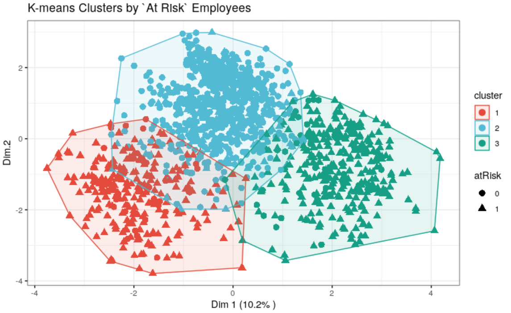

```{r setup, include = FALSE}
knitr::opts_chunk$set(error = TRUE, fig.width = 8, fig.asp = 0.618)
```

```{r load packages, import data, include = FALSE}

library(tidyverse)
library(knitr)
library(kknn)
library(ggpubr)
library(factoextra)
library(e1071)
library(rpart)
library(rpart.plot)
library(neuralnet)
library(hrbrthemes)
library(readr)
library(purrr)
library(ggthemes)
library(varhandle)
library(fastDummies)
library(kableExtra)
library(patchwork)
library(gridExtra)

testA <- read.table("data/dataTestA.txt", header = TRUE)
testB <- read.table("data/dataTestB.txt", header = TRUE)
trainA <- read.table("data/dataTrainA.txt", header = TRUE)
trainB <- read.table("data/dataTrainB.txt", header = TRUE)
```

```{r custom functions, and r script, include = FALSE}

# CLEAN AND MERGE

trainA <- as_tibble(trainA)
trainB <- as_tibble(trainB)

# Create helper functions to define thresholds for vitals variables

getmode <- function(v) {
  uniqv <- unique(v)
  uniqv[which.max(tabulate(match(v, uniqv)))]
}

temp <- function(v) {
  for (i in 1:length(v)) {
    if (!(between(v[i], 90, 106))) {
      v[i] <- mean(v)
    }
  }
  v
}

bpSys <- function(v) {
  for (i in 1:length(v)) {
    if (!(between(v[i], 90, 150))) {
      v[i] <- mean(v)
    }
  }
  v
}

vo2 <- function(v) {
  for (i in 1:length(v)) {
    if (!(between(v[i], 10, 70))) {
      v[i] <- mean(v)
    }
  }
  v
}

throat <- function(v) {
  for (i in 1:length(v)) {
    if (!(between(v[i], 80, 120))) {
      v[i] <- mean(v)
    }
  }
  v
}

headA<- function(v) {
  for (i in 1:length(v)) {
    if (!(between(v[i], 0, 9))) {
      v[i] <- getmode(v)
    }
  }
  v
}

bodyA <- function(v) {
  for (i in 1:length(v)) {
    if (!(between(v[i], 0, 9))) {
      v[i] <- getmode(v)
    }
  }
  v
}

cough <- function(v) {
  for (i in 1:length(v)) {
    if (v[i] != 1 & v[i] != 0) {
      v[i] <- getmode(v)
    }
  }
  v
}

runny <- function(v) {
  for (i in 1:length(v)) {
    if (v[i] != 1 & v[i] != 0) {
      v[i] <- getmode(v)
    }
  }
  v
}

nausea <- function(v) {
  for (i in 1:length(v)) {
    if (v[i] != 1 & v[i] != 0) {
      v[i] <- getmode(v)
    }
  }
  v
}

diarrhea <- function(v) {
  for (i in 1:length(v)) {
    if (v[i] != 1 & v[i] != 0) {
      v[i] <- getmode(v)
    }
  }
  v
}

# Vector of cleaning helper functions 
clean_helpers <- list(temp,
                      bpSys,
                      vo2,
                      throat,
                      headA,
                      bodyA,
                      cough,
                      runny,
                      nausea,
                      diarrhea)

# Function to clean and merge training data

clean_train <- function(A, B) {
  
  # Merge `trainA` and `trainB`
  merged_train <- A %>%
    select(-atRisk) %>%
    left_join(B, by = "id") %>%
    # Convert NAs of factor variables to the variable mode 
    mutate(across(6:12, ~ replace_na(., getmode(.)))) %>%
    mutate(across(2:5, as.numeric)) %>%
    # Convert NAs of numeric variables to the variable mean 
    mutate(across(2:5, ~ replace_na(., mean(., na.rm = TRUE))))
  
  # Clean data: replacing any noise with mode or mean according to type
  for (i in 2:11) {
    merged_train[, i] <- modify(merged_train[, i], clean_helpers[i - 1])
  }
  
  # Convert variables to respective types
  merged_train <- merged_train %>%
    mutate(across(6:12, as_factor))
  
  merged_train
}

xTrain <- clean_train(trainA, trainB)

# Convert datatypes of variables and merge test data; testA and testB
xTest<- testA %>%
  as_tibble() %>%
  select(-atRisk) %>%
  left_join(testB, by = "id") %>%
  mutate(across(2:5, as.numeric)) %>%
  mutate(across(6:12, as_factor))

# Functions for building random forest classification model
rando_forest <- function(x,t,n,d) {
  # two stop statements to check for out of bounds for `n` and `d`
  if (n < 1 | n > nrow(x)) {
    stop("No. of instances chosen not within no. of rows of dataframe.")
  }
  if (d < 1 | d > ncol(x)) {
    stop("No. of attributes chosen not within no. of cols of dataframe.")
  }
  
  # for loop adding `rpart` models to list
  ls <- list()
  for (i in 1:t) {
    str <- "atRisk"
    sep <- "~"
    sam_d <- sample((ncol(x)), d, replace = FALSE)
    # for loop creating string of formula for sampling attributes
    for (j in sam_d) {
      str <- paste0(str, sep, names(x)[j])
      sep <- "+"
    }
    sam_n <- sample(nrow(x), n, replace = TRUE)
    ls[[i]] <- rpart(str, x[sam_n,])
  }
  return (ls)
}

pred <- function(ls, x) {
  # for loop creating dataframe of each models predictions per instance
  df <- cbind(tibble(predict(ls[[1]], x)))
  for (i in 2:length(ls)) {
    df <- cbind(df, data_frame(predict(ls[[i]], x)))
  }
  # for loop creating vector of ensemble random forest predictions by instance
  means <- as_tibble(rowMeans(df))
  vec <- c()
  for (i in 1:nrow(means)) {
    if (means[i, 1] <= 0.50) {
      vec <- rbind(vec, 0)
    } else if (means[i, 1] > 0.50) {
      vec <- rbind(vec, 1)
    }
  }
  return(vec)
}  

# Build classification model, in this case Random Forests was chosen
xTrain_noFactors <- xTrain %>%
  mutate(across(where(is.factor), unfactor))

xTest_noFactors <- xTest %>%
  mutate(across(where(is.factor), unfactor))

forest <- rando_forest(xTrain_noFactors, t = 10, n = 5000, d = 8)
pred_forest <- pred(forest, xTest_noFactors)
pred_table <- data_frame( xTest$id, pred_forest)


# Write predictions per employee to .txt
write.table(pred_table, 
            file = "atRisk_employees_predictions.txt", 
            sep = "\t",
            row.names = FALSE, 
            col.names = TRUE)

# Generate plot of data
temp <- xTest %>%
  ggplot(aes(x = temp, color = atRisk, fill = atRisk)) +
  geom_histogram(binwidth = .01, bins = 2000, stat = "density") +
  scale_fill_brewer(name = "At Risk", palette = "Greens", labels = c("No", "Yes")) +
  scale_color_brewer(name = "At Risk", palette = "Greens", labels = c("No", "Yes")) +
  theme_tufte(base_size = 14) +
  theme(legend.text = element_text(size = 11)) +
  labs(x = "Temperature",
       y = "Density")

bpSys <- xTest %>%
  ggplot(aes(x = bpSys, color = atRisk, fill = atRisk)) +
  geom_histogram(binwidth = 1, bins = 200, stat = "density") +
  scale_fill_brewer(name = "At Risk", palette = "Greens", labels = c("No", "Yes")) +
  scale_color_brewer(name = "At Risk", palette = "Greens", labels = c("No", "Yes")) +
  theme_tufte(base_size = 14) +
  theme(legend.text = element_text(size = 11)) +
  labs(x = "Sys. Blood Pressure",
       y = "Density")

vo2 <- xTest %>%
  ggplot(aes(x = vo2, color = atRisk, fill = atRisk)) +
  geom_histogram(binwidth = 1, bins = 200, stat = "density") +
  scale_fill_brewer(name = "At Risk", palette = "Greens", labels = c("No", "Yes")) +
  scale_color_brewer(name = "At Risk", palette = "Greens", labels = c("No", "Yes")) +
  theme_tufte(base_size = 14) +
  theme(legend.text = element_text(size = 11)) +
  labs(x = "Vo2 Max",
       y = "Density")

throat <- xTest %>%
  ggplot(aes(x = throat, color = atRisk, fill = atRisk)) +
  geom_histogram(binwidth = 1, bins = 200, stat = "density") +
  scale_fill_brewer(name = "At Risk", palette = "Greens", labels = c("No", "Yes")) +
  scale_color_brewer(name = "At Risk", palette = "Greens", labels = c("No", "Yes")) +
  theme_tufte(base_size = 14) +
  theme(legend.text = element_text(size = 11)) +
  labs(x = "Throat Culture",
       y = "Density") 

plot <- (temp | bpSys) / (throat | vo2)

plot <- plot +
  plot_annotation(title = "Select Vitals Comparison",
                  subtitle = "to `atRisk` Probability",
                  caption = "Employee Vitals Data",
                  them = theme(plot.title = element_text(size = 20, face = "bold"),
                               plot.subtitle = element_text(size = 16, color = "#858585")))

# Wrie plot to .png
ggsave("plot.png", width = 40, height = 40, units = "cm")


```

# Preliminary Analysis

```{r preliminary analysis, A-train files, message=FALSE, warning=FALSE}

trainA <- as_tibble(trainA)
# Calculate summary statistics and produce visuals to check for outliers/noise/NAs
trainA %>%
  summary() %>%
  kable(caption = "Summary Table of `trainA`")
```


### Results of `trainA`

No more than one NA per dataset

+ id: looks good and no duplicates
+ temp: 1 NA, and min and max troublesome, use average
+ bbSys: 1 NA, and min and max troublesome, use average
+ vo2: 2 NA, max troublesome
+ throat: 1 NA, max troublesome
+ atRisk: looks good

```{r, test for duplicates, message=FALSE, warning=FALSE}
# Test for duplicate records
length(unique(trainA$id)) == nrow(trainA)

# Test for missing values by row: no more than one to avoid considering removal of instance
train_A_byrow<- rowSums(is.na(trainA))
max(train_A_byrow)
```

```{r preliminary analysis, B-train files, message=FALSE, warning=FALSE}
trainB <- as_tibble(trainB)

# Calculate summary statistics and produce visuals to check for outliers/noise/NAs
trainB %>%
  summary(trainB) %>%
  kable(caption = "Summary Table of `trainB`")

# Test for duplicate records
length(unique(trainB$id)) == nrow(trainB)

# Test for missing values by row: no more than one to avoid considering removal of instance
train_B_byrow <- rowSums(is.na(trainB))
max(train_B_byrow)
```

### Results of `trainB`

+ id: looks good and no duplicates
+ headA: 1 NA, max troublesome
+ bodyA: looks good
+ cough: looks good
+ runny: 1 NA
+ nausea: max is troublesome
+ diarrhea: 1 NA
+ atRisk: looks good


# Confirm outliers/missing data are cleaned
```{r confirm outliers/missing data, message = FALSE, warning=FALSE}
kable(summary(xTrain), caption = "New Summary Statistics to Confirm Cleaned Training Data")
```


#### Rationale

The table above provides confirmation of the cleaned dataset as no more missing values
are detected and all variables are within established ranges.

# Selecting a Classifier

```{r normalize data for ann, warning = FALSE, message = FALSE}

normalize <- function(x) {
return ((x - min(x)) / (max(x) - min(x)))
}

xTrain_norm <- c("")
xTrain_norm <- xTrain
for (i in 2:5) {
    xTrain_norm[, i] <- normalize(xTrain[, i])
}

xTest_norm <- c("")
xTest_norm <- xTest
for (i in 2:5) {
    xTest_norm[, i] <- normalize(xTest[, i])
}

xTrain_norm <-xTrain_norm %>%
  dummy_cols(select_columns = c("headA", "bodyA")) %>%
  select(-headA, -bodyA) %>%
  relocate(atRisk, .after = last_col()) %>%
  mutate(across(where(is.factor), unfactor)) %>%
  mutate(across(where(is.integer), as.numeric)) 

xTest_norm <-xTest_norm %>%
  dummy_cols(select_columns = c("headA", "bodyA")) %>%
  select(-headA, -bodyA) %>%
  relocate(atRisk, .after = last_col()) %>%
  mutate(across(where(is.factor), unfactor)) %>%
  mutate(across(where(is.integer), as.numeric)) 


# Create formula for factor variables depending on how many levels are used in data
xTrain_norm_formula <- c("")
for (i in 2:(ncol(xTrain_norm) - 1)) {
  if (i < (ncol(xTrain_norm) - 1)) { 
    xTrain_norm_formula <- paste0(xTrain_norm_formula, names(xTrain_norm[, i]), "+")
  } else {
      xTrain_norm_formula <- paste0(xTrain_norm_formula, names(xTrain_norm[, i]))
      xTrain_norm_formula <- paste0("atRisk~", xTrain_norm_formula)
  }
}
```

#### Rationale

The code chunk above includes normalizing the dataset which was essential to testing 
the ANN classifier due to the wide range of scales among the variables.


```{r ann, warning = FALSE, include = FALSE}
# modANN <- neuralnet(xTrain_norm_formula, xTrain_norm, hidden=2)
# 
# pred <-  neuralnet::compute(modANN, xTest_norm[, 2:ncol(xTest_norm)])
# pred$net.result
# table(pred$net.result[,1]>0.5,xTest_norm$atRisk)
# 
# plot(modANN)
```
### Best ANN Results after a few iterations

+ 85.41% accuracy with 1 hidden nodes
+ 84.19% recall with 1 hidden nodes

+ 85.41% accuracy with 2 hidden nodes
+ 83.87% recall with 2 hidden nodes

+ 70.00% accuracy with 3 hidden nodes
+ 75.41% recall with 3 hidden nodes

+ 83.79% accuracy with 4 hidden nodes
+ 83.50% recall with 4 hidden nodes

+ 28.08% accuracy with 5 hidden nodes
+ 32.98% recall with 5 hidden nodes

#### Rationale 

As you can see above, several iterations with different parameters
were used in order to produce the best results from the ANN classifier, but as hidden
nodes reached 5, performance plummeted. 

```{r random forest, warning = FALSE, message = FALSE}
forest <- rando_forest(xTrain_noFactors, t = 10, n = 5000, d = 8)
pred_forest <- pred(forest, xTest_noFactors)
table_forest <- table(pred_forest, xTest_noFactors$atRisk)

# Best with t = 10, n = 3000, d = 5
# 86.37% accuracy 
# 87.35% recall 

# Best with t = 10, n = 3000, d = 8
# 78.70% accuracy 
# 87.93% recall 

# Best with t = 10, n = 5000, d = 5
# 85.26% accuracy 
# 87.81% recall 

# Best with t = 10, n = 5000, d = 8
# 84.97% accuracy 
# 88.56% recall 
```

#### Rationale 

Above you will notice several iterations had to be performed with the random forest
classifier in order to find a good balance between overfitting with too many trees
and higher performance.


```{r compare classifiers, include=FALSE}
comparisons <- tibble("Classifier" = c("Decision Tree", "Naive Bayes", "SVM: linear", "SVM: polynomial", "ANN", "Random Forests"), "Recall" = c(85.15, 84.50, 29.75, 60.32, 84.19, 88.56), "Accuracy" = c(85.92, 84.67, 38.61, 63.67, 85.41, 84.97), "Comments" = c("took highest values after several iterations", "", "", "", "highest values from 1 hidden node, iterated up to 5 nodes", "highest values from the following parameters: t = 10, n = 5000, d = 8"))
comparisons <- comparisons %>%
  arrange(desc(Recall)) %>%
  kable(caption = "Classifier Performance")
```

```{r comparison table, message=FALSE, warning=FALSE}
comparisons
```

#### Rationale
  
The employee vitals dataset includes many features which are categorical and 4 which are continuous. Decision Trees and random forests can more can accurately divide the data based on categorical variables than many other classifiers. Additionally, the random forest had the highest Recall accuracy at 88.56%. I think it would be appropriate to emphasize Recall over Accuracy as health risks demand erring towards false positives over that of false negatives. Even so, the random forest model is bouyed by a descent Accuracy as well in comparison to the other classifiers. 


# Conclusions and Plots

```{r k-means, warning = FALSE, message = FALSE}
# Build k-means cluster with scaled data
res.km <- kmeans(scale(xTest_norm[, c(-1, -ncol(xTest_norm))]), 3, nstart =  25)
```

```{r cluster table, message=FALSE, warning=FALSE}
# Table of cluster sizes
kable(tibble("Cluster 1 Size" = res.km$size[[1]], "Cluster 2 Size" = res.km$size[[2]], "Cluster 3 Size" = res.km$size[[3]]), caption = "Numeric Size Comparison of Clusters")
```

```{r k-means plot, warning = FALSE, message = FALSE}
# Dimension reduction using PCA
res.pca <- prcomp(xTest_norm[, c(-1, -ncol(xTest_norm))],  scale = TRUE)
# Coordinates of individuals
ind.coord <- as.data.frame(get_pca_ind(res.pca)$coord)
# Add clusters obtained using the K-means algorithm
ind.coord$cluster <- factor(res.km$cluster)
# Add `headA` groups from the original data set
ind.coord$atRisk <- xTest$atRisk

# Plot K-means clusters
kmean_plot <- ggscatter(
  ind.coord, x = "Dim.1", y = "Dim.2", 
  color = "cluster", palette = "npg", ellipse = TRUE, ellipse.type = "convex",
  shape = "atRisk", size = 3,  legend = "right", ggtheme = theme_bw(),
  xlab = paste0("Dim 1 (", variance.percent[1], "% )" ),
  ylab = paste0("Dim 2 (", variance.percent[2], "% )" ) +
  stat_mean(aes(color = cluster), size = 8),
  title = "K-means Clusters by `At Risk` Employees")

## ATTRIBUTION: the kmeans clusting code above is adapted from the following site,
#https://www.datanovia.com/en/blog/k-means-clustering-visualization-in-r-step-by-step-guide/
```




### *K-means Clustering Plot*

Clustering reveals more about how much overlap and non-linear the data is, which makes
random forest a descent choice as a classifier; however, the fact that there are several discrete and continuous variables in the dataset makes the random forest stand out the most.

```{r, plot, message=FALSE, warning=FALSE}
plot
```

### *Continuous Variables Plots*

The plot of the several continuous variables above gives another illustration of how non-linear the data tends to be. Random
forests do quite well with these kinds of distributions. One interesting aspect of the data is the tendency for those within the 
upper or lower ends of the thresholds for each vital to be more at risk. Naturally, this makes sense and is encouraging as this pattern
may aid in health-related decisions. 
