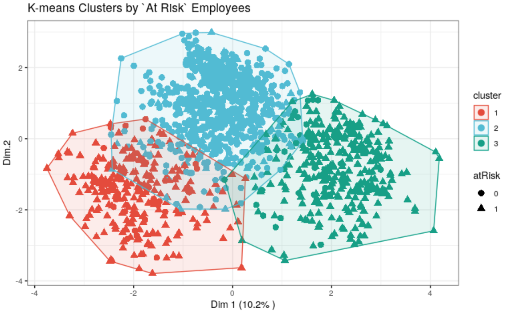
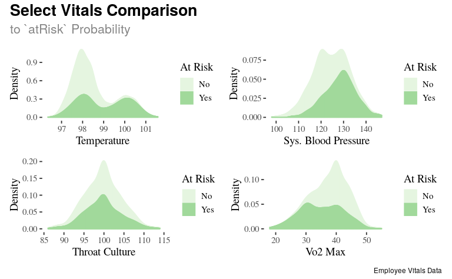

CIS635-Project
================
Tyler Reed
4/19/2021

# Preliminary Analysis

``` r
trainA <- as_tibble(trainA)
# Calculate summary statistics and produce visuals to check for outliers/noise/NAs
trainA %>%
  summary() %>%
  kable(caption = "Summary Table of `trainA`")
```

<table>

<caption>

Summary Table of `trainA`

</caption>

<thead>

<tr>

<th style="text-align:left;">

</th>

<th style="text-align:left;">

id

</th>

<th style="text-align:left;">

temp

</th>

<th style="text-align:left;">

bpSys

</th>

<th style="text-align:left;">

vo2

</th>

<th style="text-align:left;">

throat

</th>

<th style="text-align:left;">

atRisk

</th>

</tr>

</thead>

<tbody>

<tr>

<td style="text-align:left;">

</td>

<td style="text-align:left;">

Min. : 0

</td>

<td style="text-align:left;">

Min. : 15.00

</td>

<td style="text-align:left;">

Min. : 20.0

</td>

<td style="text-align:left;">

Min. : 10.00

</td>

<td style="text-align:left;">

Min. : 81

</td>

<td style="text-align:left;">

Min. :0.0000

</td>

</tr>

<tr>

<td style="text-align:left;">

</td>

<td style="text-align:left;">

1st Qu.:1673

</td>

<td style="text-align:left;">

1st Qu.: 97.79

</td>

<td style="text-align:left;">

1st Qu.:119.0

</td>

<td style="text-align:left;">

1st Qu.: 34.00

</td>

<td style="text-align:left;">

1st Qu.: 97

</td>

<td style="text-align:left;">

1st Qu.:0.0000

</td>

</tr>

<tr>

<td style="text-align:left;">

</td>

<td style="text-align:left;">

Median :3352

</td>

<td style="text-align:left;">

Median : 98.19

</td>

<td style="text-align:left;">

Median :124.0

</td>

<td style="text-align:left;">

Median : 39.00

</td>

<td style="text-align:left;">

Median :100

</td>

<td style="text-align:left;">

Median :0.0000

</td>

</tr>

<tr>

<td style="text-align:left;">

</td>

<td style="text-align:left;">

Mean :3376

</td>

<td style="text-align:left;">

Mean : 98.47

</td>

<td style="text-align:left;">

Mean :124.6

</td>

<td style="text-align:left;">

Mean : 37.76

</td>

<td style="text-align:left;">

Mean :100

</td>

<td style="text-align:left;">

Mean :0.4652

</td>

</tr>

<tr>

<td style="text-align:left;">

</td>

<td style="text-align:left;">

3rd Qu.:5084

</td>

<td style="text-align:left;">

3rd Qu.: 98.93

</td>

<td style="text-align:left;">

3rd Qu.:130.0

</td>

<td style="text-align:left;">

3rd Qu.: 42.00

</td>

<td style="text-align:left;">

3rd Qu.:103

</td>

<td style="text-align:left;">

3rd Qu.:1.0000

</td>

</tr>

<tr>

<td style="text-align:left;">

</td>

<td style="text-align:left;">

Max. :6780

</td>

<td style="text-align:left;">

Max. :198.83

</td>

<td style="text-align:left;">

Max. :501.0

</td>

<td style="text-align:left;">

Max. :150.00

</td>

<td style="text-align:left;">

Max. :122

</td>

<td style="text-align:left;">

Max. :1.0000

</td>

</tr>

<tr>

<td style="text-align:left;">

</td>

<td style="text-align:left;">

NA

</td>

<td style="text-align:left;">

NA’s :1

</td>

<td style="text-align:left;">

NA’s :1

</td>

<td style="text-align:left;">

NA’s :2

</td>

<td style="text-align:left;">

NA’s :1

</td>

<td style="text-align:left;">

NA

</td>

</tr>

</tbody>

</table>

### Results of `trainA`

  - id: looks good and no duplicates
  - temp: 1 NA, and min and max troublesome, use average
  - bbSys: 1 NA, and min and max troublesome, use average
  - vo2: 2 NA, max troublesome
  - throat: 1 NA, max troublesome
  - atRisk: looks good

<!-- end list -->

``` r
# Test for duplicate records
length(unique(trainA$id)) == nrow(trainA)
```

    ## [1] TRUE

``` r
# Test for missing values by row: no more than one to avoid considering removal of instance
train_A_byrow<- rowSums(is.na(trainA))
max(train_A_byrow)
```

    ## [1] 1

``` r
trainB <- as_tibble(trainB)

# Calculate summary statistics and produce visuals to check for outliers/noise/NAs
trainB %>%
  summary(trainB) %>%
  kable(caption = "Summary Table of `trainB`")
```

<table>

<caption>

Summary Table of `trainB`

</caption>

<thead>

<tr>

<th style="text-align:left;">

</th>

<th style="text-align:left;">

id

</th>

<th style="text-align:left;">

headA

</th>

<th style="text-align:left;">

bodyA

</th>

<th style="text-align:left;">

cough

</th>

<th style="text-align:left;">

runny

</th>

<th style="text-align:left;">

nausea

</th>

<th style="text-align:left;">

diarrhea

</th>

<th style="text-align:left;">

atRisk

</th>

</tr>

</thead>

<tbody>

<tr>

<td style="text-align:left;">

</td>

<td style="text-align:left;">

Min. : 0

</td>

<td style="text-align:left;">

Min. : 0.000

</td>

<td style="text-align:left;">

Min. :1.000

</td>

<td style="text-align:left;">

Min. :0.0000

</td>

<td style="text-align:left;">

Min. :0.0000

</td>

<td style="text-align:left;">

Min. :0.0000

</td>

<td style="text-align:left;">

Min. :0.000

</td>

<td style="text-align:left;">

Min. :0.0000

</td>

</tr>

<tr>

<td style="text-align:left;">

</td>

<td style="text-align:left;">

1st Qu.:1673

</td>

<td style="text-align:left;">

1st Qu.: 3.000

</td>

<td style="text-align:left;">

1st Qu.:4.000

</td>

<td style="text-align:left;">

1st Qu.:0.0000

</td>

<td style="text-align:left;">

1st Qu.:0.0000

</td>

<td style="text-align:left;">

1st Qu.:0.0000

</td>

<td style="text-align:left;">

1st Qu.:0.000

</td>

<td style="text-align:left;">

1st Qu.:0.0000

</td>

</tr>

<tr>

<td style="text-align:left;">

</td>

<td style="text-align:left;">

Median :3352

</td>

<td style="text-align:left;">

Median : 3.000

</td>

<td style="text-align:left;">

Median :4.000

</td>

<td style="text-align:left;">

Median :0.0000

</td>

<td style="text-align:left;">

Median :0.0000

</td>

<td style="text-align:left;">

Median :0.0000

</td>

<td style="text-align:left;">

Median :0.000

</td>

<td style="text-align:left;">

Median :0.0000

</td>

</tr>

<tr>

<td style="text-align:left;">

</td>

<td style="text-align:left;">

Mean :3376

</td>

<td style="text-align:left;">

Mean : 3.461

</td>

<td style="text-align:left;">

Mean :4.016

</td>

<td style="text-align:left;">

Mean :0.3418

</td>

<td style="text-align:left;">

Mean :0.1986

</td>

<td style="text-align:left;">

Mean :0.2367

</td>

<td style="text-align:left;">

Mean :0.102

</td>

<td style="text-align:left;">

Mean :0.4652

</td>

</tr>

<tr>

<td style="text-align:left;">

</td>

<td style="text-align:left;">

3rd Qu.:5084

</td>

<td style="text-align:left;">

3rd Qu.: 4.000

</td>

<td style="text-align:left;">

3rd Qu.:4.000

</td>

<td style="text-align:left;">

3rd Qu.:1.0000

</td>

<td style="text-align:left;">

3rd Qu.:0.0000

</td>

<td style="text-align:left;">

3rd Qu.:0.0000

</td>

<td style="text-align:left;">

3rd Qu.:0.000

</td>

<td style="text-align:left;">

3rd Qu.:1.0000

</td>

</tr>

<tr>

<td style="text-align:left;">

</td>

<td style="text-align:left;">

Max. :6780

</td>

<td style="text-align:left;">

Max. :100.000

</td>

<td style="text-align:left;">

Max. :7.000

</td>

<td style="text-align:left;">

Max. :1.0000

</td>

<td style="text-align:left;">

Max. :1.0000

</td>

<td style="text-align:left;">

Max. :5.0000

</td>

<td style="text-align:left;">

Max. :1.000

</td>

<td style="text-align:left;">

Max. :1.0000

</td>

</tr>

<tr>

<td style="text-align:left;">

</td>

<td style="text-align:left;">

NA

</td>

<td style="text-align:left;">

NA’s :1

</td>

<td style="text-align:left;">

NA

</td>

<td style="text-align:left;">

NA

</td>

<td style="text-align:left;">

NA’s :1

</td>

<td style="text-align:left;">

NA

</td>

<td style="text-align:left;">

NA’s :1

</td>

<td style="text-align:left;">

NA

</td>

</tr>

</tbody>

</table>

``` r
# Test for duplicate records
length(unique(trainB$id)) == nrow(trainB)
```

    ## [1] TRUE

``` r
# Test for missing values by row: no more than one to avoid considering removal of instance
train_B_byrow <- rowSums(is.na(trainB))
max(train_B_byrow)
```

    ## [1] 1

### Results of `trainB`

  - id: looks good and no duplicates
  - headA: 1 NA, max troublesome
  - bodyA: looks good
  - cough: looks good
  - runny: 1 NA
  - nausea: max is troublesome
  - diarrhea: 1 NA
  - atRisk: looks good

# Confirm outliers/missing data are cleaned

``` r
kable(summary(xTrain), caption = "New Summary Statistics to Confirm Cleaned Training Data")
```

<table>

<caption>

New Summary Statistics to Confirm Cleaned Training Data

</caption>

<thead>

<tr>

<th style="text-align:left;">

</th>

<th style="text-align:left;">

id

</th>

<th style="text-align:left;">

temp

</th>

<th style="text-align:left;">

bpSys

</th>

<th style="text-align:left;">

vo2

</th>

<th style="text-align:left;">

throat

</th>

<th style="text-align:left;">

headA

</th>

<th style="text-align:left;">

bodyA

</th>

<th style="text-align:left;">

cough

</th>

<th style="text-align:left;">

runny

</th>

<th style="text-align:left;">

nausea

</th>

<th style="text-align:left;">

diarrhea

</th>

<th style="text-align:left;">

atRisk

</th>

</tr>

</thead>

<tbody>

<tr>

<td style="text-align:left;">

</td>

<td style="text-align:left;">

Min. : 0

</td>

<td style="text-align:left;">

Min. : 96.18

</td>

<td style="text-align:left;">

Min. : 97.0

</td>

<td style="text-align:left;">

Min. :10.00

</td>

<td style="text-align:left;">

Min. : 81

</td>

<td style="text-align:left;">

3 :2970

</td>

<td style="text-align:left;">

1: 7

</td>

<td style="text-align:left;">

0:3570

</td>

<td style="text-align:left;">

0:4347

</td>

<td style="text-align:left;">

0:4145

</td>

<td style="text-align:left;">

0:4871

</td>

<td style="text-align:left;">

0:2901

</td>

</tr>

<tr>

<td style="text-align:left;">

</td>

<td style="text-align:left;">

1st Qu.:1673

</td>

<td style="text-align:left;">

1st Qu.: 97.79

</td>

<td style="text-align:left;">

1st Qu.:119.0

</td>

<td style="text-align:left;">

1st Qu.:34.00

</td>

<td style="text-align:left;">

1st Qu.: 97

</td>

<td style="text-align:left;">

5 : 906

</td>

<td style="text-align:left;">

2: 91

</td>

<td style="text-align:left;">

1:1854

</td>

<td style="text-align:left;">

1:1077

</td>

<td style="text-align:left;">

1:1279

</td>

<td style="text-align:left;">

1: 553

</td>

<td style="text-align:left;">

1:2523

</td>

</tr>

<tr>

<td style="text-align:left;">

</td>

<td style="text-align:left;">

Median :3352

</td>

<td style="text-align:left;">

Median : 98.19

</td>

<td style="text-align:left;">

Median :124.0

</td>

<td style="text-align:left;">

Median :39.00

</td>

<td style="text-align:left;">

Median :100

</td>

<td style="text-align:left;">

4 : 715

</td>

<td style="text-align:left;">

3: 709

</td>

<td style="text-align:left;">

NA

</td>

<td style="text-align:left;">

NA

</td>

<td style="text-align:left;">

NA

</td>

<td style="text-align:left;">

NA

</td>

<td style="text-align:left;">

NA

</td>

</tr>

<tr>

<td style="text-align:left;">

</td>

<td style="text-align:left;">

Mean :3376

</td>

<td style="text-align:left;">

Mean : 98.47

</td>

<td style="text-align:left;">

Mean :124.5

</td>

<td style="text-align:left;">

Mean :37.74

</td>

<td style="text-align:left;">

Mean :100

</td>

<td style="text-align:left;">

2 : 544

</td>

<td style="text-align:left;">

4:3745

</td>

<td style="text-align:left;">

NA

</td>

<td style="text-align:left;">

NA

</td>

<td style="text-align:left;">

NA

</td>

<td style="text-align:left;">

NA

</td>

<td style="text-align:left;">

NA

</td>

</tr>

<tr>

<td style="text-align:left;">

</td>

<td style="text-align:left;">

3rd Qu.:5084

</td>

<td style="text-align:left;">

3rd Qu.: 98.93

</td>

<td style="text-align:left;">

3rd Qu.:130.0

</td>

<td style="text-align:left;">

3rd Qu.:42.00

</td>

<td style="text-align:left;">

3rd Qu.:103

</td>

<td style="text-align:left;">

6 : 172

</td>

<td style="text-align:left;">

5: 753

</td>

<td style="text-align:left;">

NA

</td>

<td style="text-align:left;">

NA

</td>

<td style="text-align:left;">

NA

</td>

<td style="text-align:left;">

NA

</td>

<td style="text-align:left;">

NA

</td>

</tr>

<tr>

<td style="text-align:left;">

</td>

<td style="text-align:left;">

Max. :6780

</td>

<td style="text-align:left;">

Max. :101.40

</td>

<td style="text-align:left;">

Max. :149.0

</td>

<td style="text-align:left;">

Max. :58.00

</td>

<td style="text-align:left;">

Max. :116

</td>

<td style="text-align:left;">

1 : 91

</td>

<td style="text-align:left;">

6: 110

</td>

<td style="text-align:left;">

NA

</td>

<td style="text-align:left;">

NA

</td>

<td style="text-align:left;">

NA

</td>

<td style="text-align:left;">

NA

</td>

<td style="text-align:left;">

NA

</td>

</tr>

<tr>

<td style="text-align:left;">

</td>

<td style="text-align:left;">

NA

</td>

<td style="text-align:left;">

NA

</td>

<td style="text-align:left;">

NA

</td>

<td style="text-align:left;">

NA

</td>

<td style="text-align:left;">

NA

</td>

<td style="text-align:left;">

(Other): 26

</td>

<td style="text-align:left;">

7: 9

</td>

<td style="text-align:left;">

NA

</td>

<td style="text-align:left;">

NA

</td>

<td style="text-align:left;">

NA

</td>

<td style="text-align:left;">

NA

</td>

<td style="text-align:left;">

NA

</td>

</tr>

</tbody>

</table>

#### Rationale

The table above provides confirmation of the cleaned dataset as no more
missing values are detected and all variables are within established
ranges.

# Selecting a Classifier

``` r
normalize <- function(x) {
return ((x - min(x)) / (max(x) - min(x)))
}

xTrain_norm <- c("")
xTrain_norm <- xTrain
for (i in 2:5) {
    xTrain_norm[, i] <- normalize(xTrain[, i])
}

xTest_norm <- c("")
xTest_norm <- xTest
for (i in 2:5) {
    xTest_norm[, i] <- normalize(xTest[, i])
}

xTrain_norm <-xTrain_norm %>%
  dummy_cols(select_columns = c("headA", "bodyA")) %>%
  select(-headA, -bodyA) %>%
  relocate(atRisk, .after = last_col()) %>%
  mutate(across(where(is.factor), unfactor)) %>%
  mutate(across(where(is.integer), as.numeric)) 

xTest_norm <-xTest_norm %>%
  dummy_cols(select_columns = c("headA", "bodyA")) %>%
  select(-headA, -bodyA) %>%
  relocate(atRisk, .after = last_col()) %>%
  mutate(across(where(is.factor), unfactor)) %>%
  mutate(across(where(is.integer), as.numeric)) 


# Create formula for factor variables depending on how many levels are used in data
xTrain_norm_formula <- c("")
for (i in 2:(ncol(xTrain_norm) - 1)) {
  if (i < (ncol(xTrain_norm) - 1)) { 
    xTrain_norm_formula <- paste0(xTrain_norm_formula, names(xTrain_norm[, i]), "+")
  } else {
      xTrain_norm_formula <- paste0(xTrain_norm_formula, names(xTrain_norm[, i]))
      xTrain_norm_formula <- paste0("atRisk~", xTrain_norm_formula)
  }
}
```

#### Rationale

The code chunk above includes normalizing the dataset which was
essential to testing the ANN classifier due to the wide range of scales
among the variables.

### Best ANN Results after a few iterations

  - 85.41% accuracy with 1 hidden nodes

  - 84.19% recall with 1 hidden nodes

  - 85.41% accuracy with 2 hidden nodes

  - 83.87% recall with 2 hidden nodes

  - 70.00% accuracy with 3 hidden nodes

  - 75.41% recall with 3 hidden nodes

  - 83.79% accuracy with 4 hidden nodes

  - 83.50% recall with 4 hidden nodes

  - 28.08% accuracy with 5 hidden nodes

  - 32.98% recall with 5 hidden nodes

#### Rationale

As you can see above, several iterations with different parameters were
used in order to produce the best results from the ANN classifier, but
as hidden nodes reached 5, performance plummeted.

``` r
forest <- rando_forest(xTrain_noFactors, t = 10, n = 5000, d = 8)
pred_forest <- pred(forest, xTest_noFactors)
table_forest <- table(pred_forest, xTest_noFactors$atRisk)

# Best with t = 10, n = 3000, d = 5
# 86.37% accuracy 
# 87.35% recall 

# Best with t = 10, n = 3000, d = 8
# 78.70% accuracy 
# 87.93% recall 

# Best with t = 10, n = 5000, d = 5
# 85.26% accuracy 
# 87.81% recall 

# Best with t = 10, n = 5000, d = 8
# 84.97% accuracy 
# 88.56% recall 
```

#### Rationale

Above you will notice several iterations had to be performed with the
random forest classifier in order to find a good balance between
overfitting with too many trees and higher performance.

``` r
comparisons
```

<table>

<caption>

Classifier Performance

</caption>

<thead>

<tr>

<th style="text-align:left;">

Classifier

</th>

<th style="text-align:right;">

Recall

</th>

<th style="text-align:right;">

Accuracy

</th>

<th style="text-align:left;">

Comments

</th>

</tr>

</thead>

<tbody>

<tr>

<td style="text-align:left;">

Random Forests

</td>

<td style="text-align:right;">

88.56

</td>

<td style="text-align:right;">

84.97

</td>

<td style="text-align:left;">

highest values from the following parameters: t = 10, n = 5000, d = 8

</td>

</tr>

<tr>

<td style="text-align:left;">

Decision Tree

</td>

<td style="text-align:right;">

85.15

</td>

<td style="text-align:right;">

85.92

</td>

<td style="text-align:left;">

took highest values after several iterations

</td>

</tr>

<tr>

<td style="text-align:left;">

Naive Bayes

</td>

<td style="text-align:right;">

84.50

</td>

<td style="text-align:right;">

84.67

</td>

<td style="text-align:left;">

</td>

</tr>

<tr>

<td style="text-align:left;">

ANN

</td>

<td style="text-align:right;">

84.19

</td>

<td style="text-align:right;">

85.41

</td>

<td style="text-align:left;">

highest values from 1 hidden node, iterated up to 5 nodes

</td>

</tr>

<tr>

<td style="text-align:left;">

SVM: polynomial

</td>

<td style="text-align:right;">

60.32

</td>

<td style="text-align:right;">

63.67

</td>

<td style="text-align:left;">

</td>

</tr>

<tr>

<td style="text-align:left;">

SVM: linear

</td>

<td style="text-align:right;">

29.75

</td>

<td style="text-align:right;">

38.61

</td>

<td style="text-align:left;">

</td>

</tr>

</tbody>

</table>

#### Rationale

The employee vitals dataset includes many features which are categorical
and 4 which are continuous. Decision Trees and random forests can more
can accurately divide the data based on categorical variables than many
other classifiers. Additionally, the random forest had the highest
Recall at 88.56%. I think it would be appropriate to emphasize
Recall over Accuracy as health risks demand erring towards false
positives over that of false negatives. Even so, the random forest model
is bouyed by a descent Accuracy as well in comparison to the other
classifiers.

# Conclusions and Plots

``` r
# Build k-means cluster with scaled data
res.km <- kmeans(scale(xTest_norm[, c(-1, -ncol(xTest_norm))]), 3, nstart =  25)
```

``` r
# Table of cluster sizes
kable(tibble("Cluster 1 Size" = res.km$size[[1]], "Cluster 2 Size" = res.km$size[[2]], "Cluster 3 Size" = res.km$size[[3]]), caption = "Numeric Size Comparison of Clusters")
```

<table>

<caption>

Numeric Size Comparison of Clusters

</caption>

<thead>

<tr>

<th style="text-align:right;">

Cluster 1 Size

</th>

<th style="text-align:right;">

Cluster 2 Size

</th>

<th style="text-align:right;">

Cluster 3 Size

</th>

</tr>

</thead>

<tbody>

<tr>

<td style="text-align:right;">

749

</td>

<td style="text-align:right;">

339

</td>

<td style="text-align:right;">

269

</td>

</tr>

</tbody>

</table>

``` r
# Dimension reduction using PCA
res.pca <- prcomp(xTest_norm[, c(-1, -ncol(xTest_norm))],  scale = TRUE)
# Coordinates of individuals
ind.coord <- as.data.frame(get_pca_ind(res.pca)$coord)
# Add clusters obtained using the K-means algorithm
ind.coord$cluster <- factor(res.km$cluster)
# Add `headA` groups from the original data set
ind.coord$atRisk <- xTest$atRisk

# Plot K-means clusters
kmean_plot <- ggscatter(
  ind.coord, x = "Dim.1", y = "Dim.2", 
  color = "cluster", palette = "npg", ellipse = TRUE, ellipse.type = "convex",
  shape = "atRisk", size = 3,  legend = "right", ggtheme = theme_bw(),
  xlab = paste0("Dim 1 (", variance.percent[1], "% )" ),
  ylab = paste0("Dim 2 (", variance.percent[2], "% )" ) +
  stat_mean(aes(color = cluster), size = 8),
  title = "K-means Clusters by `At Risk` Employees")
```

    ## Error in paste0("Dim 1 (", variance.percent[1], "% )"): object 'variance.percent' not found

``` r
## ATTRIBUTION: the kmeans clusting code above is adapted from the following site,
#https://www.datanovia.com/en/blog/k-means-clustering-visualization-in-r-step-by-step-guide/
```



### *K-means Clustering Plot*

Clustering reveals more about how much overlap and non-linear the data
is, which makes random forest a descent choice as a classifier; however,
the fact that there are several discrete and continuous variables in the
dataset makes the random forest stand out the most.

``` r
plot
```

<!-- -->

### *Continuous Variables Plots*

The plot of the several continuous variables above gives another
illustration of how non-linear the data tends to be. Random forests do
quite well with these kinds of distributions. One interesting aspect of
the data is the tendency for those within the upper or lower ends of the
thresholds for the `temp` and `vo2 max` vitals to be more at risk. Naturally, this makes
sense and is encouraging as this pattern may aid in health-related
decisions. However, the fact that the mean of the `throat` distribution is most likely to 
be at risk is concerning when considered alone. The `bpSys' seems to be show a pattern of
higher risk when higher the value. 
