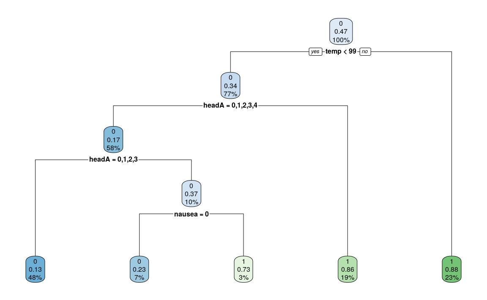

CIS635-Project
================
Tyler Reed
4/19/2021

``` r
knitr::opts_chunk$set(error = TRUE, fig.width = 12, fig.asp = 0.618)
```

``` r
library(tidyverse)
library(knitr)
library(e1071)
library(rpart)
library(rpart.plot)
library(neuralnet)
library(hrbrthemes)
library(readr)
library(purrr)
library(ggthemes)
library(varhandle)
library(fastDummies)

testA <- read.table("data/dataTestA.txt", header = TRUE)
testB <- read.table("data/dataTestB.txt", header = TRUE)
trainA <- read.table("data/dataTrainA.txt", header = TRUE)
trainB <- read.table("data/dataTrainB.txt", header = TRUE)
```

``` r
# PRELIMINARY ANALYSIS AND CLEANUP, NO GRAPHS, AND MERGE


trainA <- as_tibble(trainA)

# Calculate summary statistics and produce visuals to check for outliers/noise/NAs
trainA %>%
  summary() %>%
  kable()
```

|  | id           | temp           | bpSys         | vo2            | throat      | atRisk         |
| :- | :----------- | :------------- | :------------ | :------------- | :---------- | :------------- |
|  | Min. : 0     | Min. : 15.00   | Min. : 20.0   | Min. : 10.00   | Min. : 81   | Min. :0.0000   |
|  | 1st Qu.:1673 | 1st Qu.: 97.79 | 1st Qu.:119.0 | 1st Qu.: 34.00 | 1st Qu.: 97 | 1st Qu.:0.0000 |
|  | Median :3352 | Median : 98.19 | Median :124.0 | Median : 39.00 | Median :100 | Median :0.0000 |
|  | Mean :3376   | Mean : 98.47   | Mean :124.6   | Mean : 37.76   | Mean :100   | Mean :0.4652   |
|  | 3rd Qu.:5084 | 3rd Qu.: 98.93 | 3rd Qu.:130.0 | 3rd Qu.: 42.00 | 3rd Qu.:103 | 3rd Qu.:1.0000 |
|  | Max. :6780   | Max. :198.83   | Max. :501.0   | Max. :150.00   | Max. :122   | Max. :1.0000   |
|  | NA           | NA’s :1        | NA’s :1       | NA’s :2        | NA’s :1     | NA             |

``` r
# trainA  %>%
#   mutate(across(.cols = everything(), as_factor)) %>%
#   keep(is.numeric) %>% 
#   gather() %>% 
#   ggplot(aes(value)) +
#     facet_wrap(~ key, scales = "free") +
#     theme_tufte(base_size = 16) +
#     geom_histogram(color = "royalblue", bins = 500)

# Test for duplicate records
length(unique(trainA$id)) == nrow(trainA)
```

    ## [1] TRUE

``` r
# Test for missing values by row
train_A_byrow<- rowSums(is.na(trainA))
max(train_A_byrow)
```

    ## [1] 1

``` r
# Results

# No more than one NA per dataset

# id: looks good and no duplicates
# temp: 1 NA, and min and max troublesome, use average
# bbSys: 1 NA, and min and max troublesome, use average
# vo2: 2 NA, max troublesome
# throat: 1 NA, max troublesome
# atRisk: looks good
```

``` r
trainB <- as_tibble(trainB)

# Calculate summary statistics and produce visuals to check for outliers/noise/NAs
trainB %>%
  summary(trainB) %>%
  kable()
```

|  | id           | headA          | bodyA         | cough          | runny          | nausea         | diarrhea      | atRisk         |
| :- | :----------- | :------------- | :------------ | :------------- | :------------- | :------------- | :------------ | :------------- |
|  | Min. : 0     | Min. : 0.000   | Min. :1.000   | Min. :0.0000   | Min. :0.0000   | Min. :0.0000   | Min. :0.000   | Min. :0.0000   |
|  | 1st Qu.:1673 | 1st Qu.: 3.000 | 1st Qu.:4.000 | 1st Qu.:0.0000 | 1st Qu.:0.0000 | 1st Qu.:0.0000 | 1st Qu.:0.000 | 1st Qu.:0.0000 |
|  | Median :3352 | Median : 3.000 | Median :4.000 | Median :0.0000 | Median :0.0000 | Median :0.0000 | Median :0.000 | Median :0.0000 |
|  | Mean :3376   | Mean : 3.461   | Mean :4.016   | Mean :0.3418   | Mean :0.1986   | Mean :0.2367   | Mean :0.102   | Mean :0.4652   |
|  | 3rd Qu.:5084 | 3rd Qu.: 4.000 | 3rd Qu.:4.000 | 3rd Qu.:1.0000 | 3rd Qu.:0.0000 | 3rd Qu.:0.0000 | 3rd Qu.:0.000 | 3rd Qu.:1.0000 |
|  | Max. :6780   | Max. :100.000  | Max. :7.000   | Max. :1.0000   | Max. :1.0000   | Max. :5.0000   | Max. :1.000   | Max. :1.0000   |
|  | NA           | NA’s :1        | NA            | NA             | NA’s :1        | NA             | NA’s :1       | NA             |

``` r
# 
# trainA %>%
#   mutate(across(.cols = everything(), as_factor)) %>%
#   select(-id) %>%
#   filter(temp > 106) %>%
#   ggplot(aes(x = temp)) +
#     geom_bar(fill = "royalblue", position = "dodge") +
#     scale_fill_brewer(palette = "Dark2") +
#     theme_tufte(base_size = 16) 
    


# Test for duplicate records
length(unique(trainB$id)) == nrow(trainB)
```

    ## [1] TRUE

``` r
# Test for missing values by row
train_B_byrow <- rowSums(is.na(trainB))
max(train_B_byrow)
```

    ## [1] 1

``` r
# Results

# id: looks good and no duplicates
# headA: 1 NA, max troublesome
# bodyA: looks good
# cough: looks good
# runny: 1 NA
# nausea: max is troublesome
# diarrhea: 1 NA
# atRisk: looks good
```

``` r
clean_train <- function(A, B) {
  
  # Merge `trainA` and `trainB`
  merged_train <- A %>%
    select(-atRisk) %>%
    left_join(B, by = "id") %>%
    # Convert NAs of factor variables to the variable mode 
    mutate(across(6:12, ~ replace_na(., getmode(.)))) %>%
    mutate(across(2:5, as.numeric)) %>%
    # Convert NAs of numeric variables to the variable mean 
    mutate(across(2:5, ~ replace_na(., mean(., na.rm = TRUE))))

  # Clean data: replacing any noise with mode or mean according to type
  for (i in 2:11) {
      merged_train[, i] <- modify(merged_train[, i], clean_helpers[i - 1])
  }
  
  # Convert variables to respective types
  merged_train <- merged_train %>%
    mutate(across(6:12, as_factor))
  
  merged_train
}

xTrain <- clean_train(trainA, trainB)

kable(summary(xTrain), caption = "New Summary Statistics to Confirm Cleaned Training Data")
```

|  | id           | temp           | bpSys         | vo2           | throat      | headA       | bodyA  | cough  | runny  | nausea | diarrhea | atRisk |
| :- | :----------- | :------------- | :------------ | :------------ | :---------- | :---------- | :----- | :----- | :----- | :----- | :------- | :----- |
|  | Min. : 0     | Min. : 96.18   | Min. : 97.0   | Min. :10.00   | Min. : 81   | 3 :2970     | 1: 7   | 0:3570 | 0:4347 | 0:4145 | 0:4871   | 0:2901 |
|  | 1st Qu.:1673 | 1st Qu.: 97.79 | 1st Qu.:119.0 | 1st Qu.:34.00 | 1st Qu.: 97 | 5 : 906     | 2: 91  | 1:1854 | 1:1077 | 1:1279 | 1: 553   | 1:2523 |
|  | Median :3352 | Median : 98.19 | Median :124.0 | Median :39.00 | Median :100 | 4 : 715     | 3: 709 | NA     | NA     | NA     | NA       | NA     |
|  | Mean :3376   | Mean : 98.47   | Mean :124.5   | Mean :37.74   | Mean :100   | 2 : 544     | 4:3745 | NA     | NA     | NA     | NA       | NA     |
|  | 3rd Qu.:5084 | 3rd Qu.: 98.93 | 3rd Qu.:130.0 | 3rd Qu.:42.00 | 3rd Qu.:103 | 6 : 172     | 5: 753 | NA     | NA     | NA     | NA       | NA     |
|  | Max. :6780   | Max. :101.40   | Max. :149.0   | Max. :58.00   | Max. :116   | 1 : 91      | 6: 110 | NA     | NA     | NA     | NA       | NA     |
|  | NA           | NA             | NA            | NA            | NA          | (Other): 26 | 7: 9   | NA     | NA     | NA     | NA       | NA     |

New Summary Statistics to Confirm Cleaned Training Data

``` r
# Convert datatypes of variables and merge test data; testA and testB
xTest<- testA %>%
    as_tibble() %>%
    select(-atRisk) %>%
    left_join(testB, by = "id") %>%
    mutate(across(2:5, as.numeric)) %>%
    mutate(across(6:12, as_factor))
```

``` r
modTree <- rpart(atRisk~temp+bpSys+vo2+throat+headA+bodyA+cough+runny+nausea+diarrhea, xTrain)

rpart.plot(modTree)
```

<!-- -->

``` r
predTree <- predict(modTree, xTest, type = "vector")
table(predTree, xTest$atRisk)
```

    ##         
    ## predTree   0   1
    ##        1 644 100
    ##        2  91 522

``` r
# 85.92% Accuracy
# 85.15% Recall
```

``` r
modBayes <- naiveBayes(atRisk~.-id, xTrain)
predBayes <- predict(modBayes, xTest)
table(predBayes, xTest$atRisk)
```

    ##          
    ## predBayes   0   1
    ##         0 642 115
    ##         1  93 507

``` r
# 84.67% Accuracy
# 84.5% Recall
```

``` r
xTrain_noFactors <- xTrain %>%
  mutate(across(where(is.factor), unfactor))

xTest_noFactors <- xTest %>%
  mutate(across(where(is.factor), unfactor))

modSVM <- svm(xTrain_noFactors[, 2:11], kernel = "linear")
predSVM <- predict(modSVM, xTest_noFactors[, 2:11])
table(predSVM, xTest_noFactors$atRisk)
```

    ##        
    ## predSVM   0   1
    ##   FALSE 369 467
    ##   TRUE  366 155

``` r
# 38.61% Accuracy
# 29.75% Recall

modSVM_Poly <- svm(xTrain_noFactors[, 2:11], kernel = "polynomial")
predSVM_Poly <- predict(modSVM_Poly, xTest_noFactors[, 2:11])
table(predSVM_Poly, xTest_noFactors$atRisk)
```

    ##             
    ## predSVM_Poly   0   1
    ##        FALSE 487 245
    ##        TRUE  248 377

``` r
# 63.67% Accuracy
# 60.32% Recall
```

``` r
normalize <- function(x) {
return ((x - min(x)) / (max(x) - min(x)))
}

xTrain_norm <- c("")
xTrain_norm <- xTrain
for (i in 2:5) {
    xTrain_norm[, i] <- normalize(xTrain[, i])
}

xTest_norm <- c("")
xTest_norm <- xTest
for (i in 2:5) {
    xTest_norm[, i] <- normalize(xTest[, i])
}

xTrain_norm <-xTrain_norm %>%
  dummy_cols(select_columns = c("headA", "bodyA")) %>%
  select(-headA, -bodyA) %>%
  relocate(atRisk, .after = last_col()) %>%
  mutate(across(where(is.factor), unfactor)) %>%
  mutate(across(where(is.integer), as.numeric)) 

xTest_norm <-xTest_norm %>%
  dummy_cols(select_columns = c("headA", "bodyA")) %>%
  select(-headA, -bodyA) %>%
  relocate(atRisk, .after = last_col()) %>%
  mutate(across(where(is.factor), unfactor)) %>%
  mutate(across(where(is.integer), as.numeric)) 


# Create formula for factor variables depending on how many levels are used in data
xTrain_norm_formula <- c("")
for (i in 2:(ncol(xTrain_norm) - 1)) {
  if (i < (ncol(xTrain_norm) - 1)) { 
    xTrain_norm_formula <- paste0(xTrain_norm_formula, names(xTrain_norm[, i]), "+")
  } else {
      xTrain_norm_formula <- paste0(xTrain_norm_formula, names(xTrain_norm[, i]))
      xTrain_norm_formula <- paste0("atRisk~", xTrain_norm_formula)
  }
}
```

``` r
# modANN <- neuralnet(xTrain_norm_formula, xTrain_norm, hidden=2)
# 
# pred <-  neuralnet::compute(modANN, xTest_norm[, 2:ncol(xTest_norm)])
# pred$net.result
# table(pred$net.result[,1]>0.5,xTest_norm$atRisk)
# 
# plot(modANN)

# Best ANN Results after a few iterations 

# 85.41% accuracy with 1 hidden nodes
# 84.19% recall with 1 hidden nodes

# 85.41% accuracy with 2 hidden nodes
# 83.87% recall with 2 hidden nodes

# 70.00% accuracy with 3 hidden nodes
# 75.41% recall with 3 hidden nodes

# 83.79% accuracy with 4 hidden nodes
# 83.50% recall with 4 hidden nodes

# 28.08% accuracy with 5 hidden nodes
# 32.98% recall with 5 hidden nodes
```

``` r
# Tyler Reed
# CIS 635
# Winter 2021

rando_forest <- function(x,t,n,d) {
  # two stop statements to check for out of bounds for `n` and `d`
  if (n < 1 | n > nrow(x)) {
    stop("No. of instances chosen not within no. of rows of dataframe.")
  }
  if (d < 1 | d > ncol(x)) {
    stop("No. of attributes chosen not within no. of cols of dataframe.")
  }
  
  # for loop adding `rpart` models to list
  ls <- list()
  for (i in 1:t) {
    str <- "atRisk"
    sep <- "~"
    sam_d <- sample((ncol(x)), d, replace = FALSE)
    # for loop creating string of formula for sampling attributes
    for (j in sam_d) {
      str <- paste0(str, sep, names(x)[j])
      sep <- "+"
    }
    sam_n <- sample(nrow(x), n, replace = TRUE)
    ls[[i]] <- rpart(str, x[sam_n,])
  }
  return (ls)
}

pred <- function(ls, x) {
  # for loop creating dataframe of each models predictions per instance
  df <- cbind(tibble(predict(ls[[1]], x, type = "vector")))
  for (i in 2:length(ls)) {
    df <- cbind(df, data_frame(predict(ls[[i]], x)))
  }
  # for loop creating vector of ensemble random forest predictions by instance
  means <- as_tibble(rowMeans(df))
  vec <- c()
  for (i in 1:nrow(means)) {
    if (means[i, 1] <= 0.50) {
      vec <- rbind(vec, 0)
    } else if (means[i, 1] > 0.50) {
        vec <- rbind(vec, 1)
    }
  }
  return(vec)
}  
```

``` r
xTrain_forest <- xTrain %>%
  select(-id)

forest <- rando_forest(xTrain_forest, t = 10, n = 3000, d = 5)

# forest %>%
#   pred(xTest[, 2:ncol(xTest)])

predict(forest[[1]], xTest)
```

    ##               0         1
    ## 1    0.35344828 0.6465517
    ## 2    0.80851064 0.1914894
    ## 3    0.09571429 0.9042857
    ## 4    0.16609589 0.8339041
    ## 5    0.09571429 0.9042857
    ## 6    0.35344828 0.6465517
    ## 7    0.87818697 0.1218130
    ## 8    0.87818697 0.1218130
    ## 9    0.09571429 0.9042857
    ## 10   0.35344828 0.6465517
    ## 11   0.16609589 0.8339041
    ## 12   0.09571429 0.9042857
    ## 13   0.09571429 0.9042857
    ## 14   0.09571429 0.9042857
    ## 15   0.16609589 0.8339041
    ## 16   0.87818697 0.1218130
    ## 17   0.16609589 0.8339041
    ## 18   0.87818697 0.1218130
    ## 19   0.87818697 0.1218130
    ## 20   0.87818697 0.1218130
    ## 21   0.16609589 0.8339041
    ## 22   0.16609589 0.8339041
    ## 23   0.09571429 0.9042857
    ## 24   0.87818697 0.1218130
    ## 25   0.87818697 0.1218130
    ## 26   0.80851064 0.1914894
    ## 27   0.87818697 0.1218130
    ## 28   0.87818697 0.1218130
    ## 29   0.87818697 0.1218130
    ## 30   0.09571429 0.9042857
    ## 31   0.87818697 0.1218130
    ## 32   0.87818697 0.1218130
    ## 33   0.09571429 0.9042857
    ## 34   0.87818697 0.1218130
    ## 35   0.87818697 0.1218130
    ## 36   0.87818697 0.1218130
    ## 37   0.16609589 0.8339041
    ## 38   0.09571429 0.9042857
    ## 39   0.87818697 0.1218130
    ## 40   0.09571429 0.9042857
    ## 41   0.87818697 0.1218130
    ## 42   0.87818697 0.1218130
    ## 43   0.09571429 0.9042857
    ## 44   0.16609589 0.8339041
    ## 45   0.35344828 0.6465517
    ## 46   0.09571429 0.9042857
    ## 47   0.87818697 0.1218130
    ## 48   0.87818697 0.1218130
    ## 49   0.16609589 0.8339041
    ## 50   0.87818697 0.1218130
    ## 51   0.87818697 0.1218130
    ## 52   0.09571429 0.9042857
    ## 53   0.87818697 0.1218130
    ## 54   0.16609589 0.8339041
    ## 55   0.87818697 0.1218130
    ## 56   0.09571429 0.9042857
    ## 57   0.09571429 0.9042857
    ## 58   0.09571429 0.9042857
    ## 59   0.87818697 0.1218130
    ## 60   0.09571429 0.9042857
    ## 61   0.87818697 0.1218130
    ## 62   0.16609589 0.8339041
    ## 63   0.87818697 0.1218130
    ## 64   0.87818697 0.1218130
    ## 65   0.16609589 0.8339041
    ## 66   0.87818697 0.1218130
    ## 67   0.87818697 0.1218130
    ## 68   0.09571429 0.9042857
    ## 69   0.09571429 0.9042857
    ## 70   0.09571429 0.9042857
    ## 71   0.87818697 0.1218130
    ## 72   0.87818697 0.1218130
    ## 73   0.87818697 0.1218130
    ## 74   0.16609589 0.8339041
    ## 75   0.16609589 0.8339041
    ## 76   0.16609589 0.8339041
    ## 77   0.87818697 0.1218130
    ## 78   0.87818697 0.1218130
    ## 79   0.87818697 0.1218130
    ## 80   0.87818697 0.1218130
    ## 81   0.35344828 0.6465517
    ## 82   0.87818697 0.1218130
    ## 83   0.09571429 0.9042857
    ## 84   0.87818697 0.1218130
    ## 85   0.09571429 0.9042857
    ## 86   0.87818697 0.1218130
    ## 87   0.09571429 0.9042857
    ## 88   0.87818697 0.1218130
    ## 89   0.87818697 0.1218130
    ## 90   0.87818697 0.1218130
    ## 91   0.35344828 0.6465517
    ## 92   0.87818697 0.1218130
    ## 93   0.09571429 0.9042857
    ## 94   0.87818697 0.1218130
    ## 95   0.87818697 0.1218130
    ## 96   0.87818697 0.1218130
    ## 97   0.35344828 0.6465517
    ## 98   0.09571429 0.9042857
    ## 99   0.87818697 0.1218130
    ## 100  0.87818697 0.1218130
    ## 101  0.16609589 0.8339041
    ## 102  0.87818697 0.1218130
    ## 103  0.80851064 0.1914894
    ## 104  0.87818697 0.1218130
    ## 105  0.87818697 0.1218130
    ## 106  0.16609589 0.8339041
    ## 107  0.87818697 0.1218130
    ## 108  0.87818697 0.1218130
    ## 109  0.87818697 0.1218130
    ## 110  0.87818697 0.1218130
    ## 111  0.16609589 0.8339041
    ## 112  0.87818697 0.1218130
    ## 113  0.87818697 0.1218130
    ## 114  0.87818697 0.1218130
    ## 115  0.87818697 0.1218130
    ## 116  0.87818697 0.1218130
    ## 117  0.87818697 0.1218130
    ## 118  0.16609589 0.8339041
    ## 119  0.09571429 0.9042857
    ## 120  0.87818697 0.1218130
    ## 121  0.87818697 0.1218130
    ## 122  0.87818697 0.1218130
    ## 123  0.09571429 0.9042857
    ## 124  0.16609589 0.8339041
    ## 125  0.09571429 0.9042857
    ## 126  0.16609589 0.8339041
    ## 127  0.80851064 0.1914894
    ## 128  0.87818697 0.1218130
    ## 129  0.87818697 0.1218130
    ## 130  0.87818697 0.1218130
    ## 131  0.87818697 0.1218130
    ## 132  0.87818697 0.1218130
    ## 133  0.35344828 0.6465517
    ## 134  0.09571429 0.9042857
    ## 135  0.09571429 0.9042857
    ## 136  0.16609589 0.8339041
    ## 137  0.87818697 0.1218130
    ## 138  0.87818697 0.1218130
    ## 139  0.16609589 0.8339041
    ## 140  0.35344828 0.6465517
    ## 141  0.09571429 0.9042857
    ## 142  0.09571429 0.9042857
    ## 143  0.16609589 0.8339041
    ## 144  0.87818697 0.1218130
    ## 145  0.16609589 0.8339041
    ## 146  0.87818697 0.1218130
    ## 147  0.16609589 0.8339041
    ## 148  0.87818697 0.1218130
    ## 149  0.87818697 0.1218130
    ## 150  0.09571429 0.9042857
    ## 151  0.87818697 0.1218130
    ## 152  0.87818697 0.1218130
    ## 153  0.87818697 0.1218130
    ## 154  0.87818697 0.1218130
    ## 155  0.35344828 0.6465517
    ## 156  0.80851064 0.1914894
    ## 157  0.87818697 0.1218130
    ## 158  0.09571429 0.9042857
    ## 159  0.87818697 0.1218130
    ## 160  0.87818697 0.1218130
    ## 161  0.16609589 0.8339041
    ## 162  0.87818697 0.1218130
    ## 163  0.09571429 0.9042857
    ## 164  0.16609589 0.8339041
    ## 165  0.16609589 0.8339041
    ## 166  0.87818697 0.1218130
    ## 167  0.16609589 0.8339041
    ## 168  0.09571429 0.9042857
    ## 169  0.09571429 0.9042857
    ## 170  0.87818697 0.1218130
    ## 171  0.09571429 0.9042857
    ## 172  0.16609589 0.8339041
    ## 173  0.87818697 0.1218130
    ## 174  0.87818697 0.1218130
    ## 175  0.16609589 0.8339041
    ## 176  0.87818697 0.1218130
    ## 177  0.16609589 0.8339041
    ## 178  0.09571429 0.9042857
    ## 179  0.87818697 0.1218130
    ## 180  0.87818697 0.1218130
    ## 181  0.09571429 0.9042857
    ## 182  0.16609589 0.8339041
    ## 183  0.87818697 0.1218130
    ## 184  0.87818697 0.1218130
    ## 185  0.87818697 0.1218130
    ## 186  0.09571429 0.9042857
    ## 187  0.35344828 0.6465517
    ## 188  0.87818697 0.1218130
    ## 189  0.16609589 0.8339041
    ## 190  0.16609589 0.8339041
    ## 191  0.09571429 0.9042857
    ## 192  0.87818697 0.1218130
    ## 193  0.87818697 0.1218130
    ## 194  0.87818697 0.1218130
    ## 195  0.80851064 0.1914894
    ## 196  0.09571429 0.9042857
    ## 197  0.87818697 0.1218130
    ## 198  0.09571429 0.9042857
    ## 199  0.09571429 0.9042857
    ## 200  0.09571429 0.9042857
    ## 201  0.87818697 0.1218130
    ## 202  0.80851064 0.1914894
    ## 203  0.09571429 0.9042857
    ## 204  0.87818697 0.1218130
    ## 205  0.87818697 0.1218130
    ## 206  0.87818697 0.1218130
    ## 207  0.87818697 0.1218130
    ## 208  0.16609589 0.8339041
    ## 209  0.80851064 0.1914894
    ## 210  0.16609589 0.8339041
    ## 211  0.80851064 0.1914894
    ## 212  0.87818697 0.1218130
    ## 213  0.87818697 0.1218130
    ## 214  0.87818697 0.1218130
    ## 215  0.87818697 0.1218130
    ## 216  0.87818697 0.1218130
    ## 217  0.16609589 0.8339041
    ## 218  0.87818697 0.1218130
    ## 219  0.87818697 0.1218130
    ## 220  0.87818697 0.1218130
    ## 221  0.09571429 0.9042857
    ## 222  0.16609589 0.8339041
    ## 223  0.09571429 0.9042857
    ## 224  0.87818697 0.1218130
    ## 225  0.09571429 0.9042857
    ## 226  0.87818697 0.1218130
    ## 227  0.87818697 0.1218130
    ## 228  0.80851064 0.1914894
    ## 229  0.16609589 0.8339041
    ## 230  0.87818697 0.1218130
    ## 231  0.09571429 0.9042857
    ## 232  0.87818697 0.1218130
    ## 233  0.87818697 0.1218130
    ## 234  0.16609589 0.8339041
    ## 235  0.09571429 0.9042857
    ## 236  0.87818697 0.1218130
    ## 237  0.80851064 0.1914894
    ## 238  0.87818697 0.1218130
    ## 239  0.16609589 0.8339041
    ## 240  0.35344828 0.6465517
    ## 241  0.16609589 0.8339041
    ## 242  0.87818697 0.1218130
    ## 243  0.16609589 0.8339041
    ## 244  0.87818697 0.1218130
    ## 245  0.80851064 0.1914894
    ## 246  0.16609589 0.8339041
    ## 247  0.87818697 0.1218130
    ## 248  0.87818697 0.1218130
    ## 249  0.87818697 0.1218130
    ## 250  0.80851064 0.1914894
    ## 251  0.87818697 0.1218130
    ## 252  0.35344828 0.6465517
    ## 253  0.87818697 0.1218130
    ## 254  0.16609589 0.8339041
    ## 255  0.16609589 0.8339041
    ## 256  0.87818697 0.1218130
    ## 257  0.09571429 0.9042857
    ## 258  0.87818697 0.1218130
    ## 259  0.80851064 0.1914894
    ## 260  0.87818697 0.1218130
    ## 261  0.09571429 0.9042857
    ## 262  0.87818697 0.1218130
    ## 263  0.16609589 0.8339041
    ## 264  0.16609589 0.8339041
    ## 265  0.87818697 0.1218130
    ## 266  0.09571429 0.9042857
    ## 267  0.09571429 0.9042857
    ## 268  0.87818697 0.1218130
    ## 269  0.87818697 0.1218130
    ## 270  0.87818697 0.1218130
    ## 271  0.09571429 0.9042857
    ## 272  0.16609589 0.8339041
    ## 273  0.16609589 0.8339041
    ## 274  0.09571429 0.9042857
    ## 275  0.87818697 0.1218130
    ## 276  0.09571429 0.9042857
    ## 277  0.09571429 0.9042857
    ## 278  0.09571429 0.9042857
    ## 279  0.87818697 0.1218130
    ## 280  0.16609589 0.8339041
    ## 281  0.09571429 0.9042857
    ## 282  0.09571429 0.9042857
    ## 283  0.35344828 0.6465517
    ## 284  0.87818697 0.1218130
    ## 285  0.87818697 0.1218130
    ## 286  0.16609589 0.8339041
    ## 287  0.87818697 0.1218130
    ## 288  0.16609589 0.8339041
    ## 289  0.35344828 0.6465517
    ## 290  0.87818697 0.1218130
    ## 291  0.87818697 0.1218130
    ## 292  0.87818697 0.1218130
    ## 293  0.87818697 0.1218130
    ## 294  0.87818697 0.1218130
    ## 295  0.87818697 0.1218130
    ## 296  0.09571429 0.9042857
    ## 297  0.87818697 0.1218130
    ## 298  0.09571429 0.9042857
    ## 299  0.87818697 0.1218130
    ## 300  0.09571429 0.9042857
    ## 301  0.87818697 0.1218130
    ## 302  0.87818697 0.1218130
    ## 303  0.87818697 0.1218130
    ## 304  0.80851064 0.1914894
    ## 305  0.09571429 0.9042857
    ## 306  0.09571429 0.9042857
    ## 307  0.16609589 0.8339041
    ## 308  0.16609589 0.8339041
    ## 309  0.80851064 0.1914894
    ## 310  0.87818697 0.1218130
    ## 311  0.87818697 0.1218130
    ## 312  0.87818697 0.1218130
    ## 313  0.87818697 0.1218130
    ## 314  0.80851064 0.1914894
    ## 315  0.16609589 0.8339041
    ## 316  0.16609589 0.8339041
    ## 317  0.87818697 0.1218130
    ## 318  0.16609589 0.8339041
    ## 319  0.09571429 0.9042857
    ## 320  0.87818697 0.1218130
    ## 321  0.87818697 0.1218130
    ## 322  0.87818697 0.1218130
    ## 323  0.87818697 0.1218130
    ## 324  0.87818697 0.1218130
    ## 325  0.09571429 0.9042857
    ## 326  0.87818697 0.1218130
    ## 327  0.09571429 0.9042857
    ## 328  0.09571429 0.9042857
    ## 329  0.87818697 0.1218130
    ## 330  0.87818697 0.1218130
    ## 331  0.87818697 0.1218130
    ## 332  0.87818697 0.1218130
    ## 333  0.87818697 0.1218130
    ## 334  0.35344828 0.6465517
    ## 335  0.87818697 0.1218130
    ## 336  0.87818697 0.1218130
    ## 337  0.87818697 0.1218130
    ## 338  0.87818697 0.1218130
    ## 339  0.09571429 0.9042857
    ## 340  0.09571429 0.9042857
    ## 341  0.87818697 0.1218130
    ## 342  0.09571429 0.9042857
    ## 343  0.16609589 0.8339041
    ## 344  0.87818697 0.1218130
    ## 345  0.09571429 0.9042857
    ## 346  0.09571429 0.9042857
    ## 347  0.09571429 0.9042857
    ## 348  0.87818697 0.1218130
    ## 349  0.16609589 0.8339041
    ## 350  0.16609589 0.8339041
    ## 351  0.09571429 0.9042857
    ## 352  0.87818697 0.1218130
    ## 353  0.87818697 0.1218130
    ## 354  0.16609589 0.8339041
    ## 355  0.16609589 0.8339041
    ## 356  0.87818697 0.1218130
    ## 357  0.16609589 0.8339041
    ## 358  0.09571429 0.9042857
    ## 359  0.87818697 0.1218130
    ## 360  0.09571429 0.9042857
    ## 361  0.87818697 0.1218130
    ## 362  0.87818697 0.1218130
    ## 363  0.87818697 0.1218130
    ## 364  0.87818697 0.1218130
    ## 365  0.16609589 0.8339041
    ## 366  0.16609589 0.8339041
    ## 367  0.16609589 0.8339041
    ## 368  0.87818697 0.1218130
    ## 369  0.09571429 0.9042857
    ## 370  0.09571429 0.9042857
    ## 371  0.87818697 0.1218130
    ## 372  0.09571429 0.9042857
    ## 373  0.80851064 0.1914894
    ## 374  0.16609589 0.8339041
    ## 375  0.87818697 0.1218130
    ## 376  0.09571429 0.9042857
    ## 377  0.09571429 0.9042857
    ## 378  0.87818697 0.1218130
    ## 379  0.87818697 0.1218130
    ## 380  0.09571429 0.9042857
    ## 381  0.16609589 0.8339041
    ## 382  0.87818697 0.1218130
    ## 383  0.16609589 0.8339041
    ## 384  0.87818697 0.1218130
    ## 385  0.87818697 0.1218130
    ## 386  0.80851064 0.1914894
    ## 387  0.87818697 0.1218130
    ## 388  0.35344828 0.6465517
    ## 389  0.87818697 0.1218130
    ## 390  0.09571429 0.9042857
    ## 391  0.87818697 0.1218130
    ## 392  0.87818697 0.1218130
    ## 393  0.87818697 0.1218130
    ## 394  0.35344828 0.6465517
    ## 395  0.16609589 0.8339041
    ## 396  0.87818697 0.1218130
    ## 397  0.87818697 0.1218130
    ## 398  0.87818697 0.1218130
    ## 399  0.87818697 0.1218130
    ## 400  0.16609589 0.8339041
    ## 401  0.16609589 0.8339041
    ## 402  0.87818697 0.1218130
    ## 403  0.87818697 0.1218130
    ## 404  0.87818697 0.1218130
    ## 405  0.87818697 0.1218130
    ## 406  0.87818697 0.1218130
    ## 407  0.87818697 0.1218130
    ## 408  0.35344828 0.6465517
    ## 409  0.09571429 0.9042857
    ## 410  0.87818697 0.1218130
    ## 411  0.87818697 0.1218130
    ## 412  0.87818697 0.1218130
    ## 413  0.87818697 0.1218130
    ## 414  0.09571429 0.9042857
    ## 415  0.35344828 0.6465517
    ## 416  0.16609589 0.8339041
    ## 417  0.09571429 0.9042857
    ## 418  0.16609589 0.8339041
    ## 419  0.09571429 0.9042857
    ## 420  0.09571429 0.9042857
    ## 421  0.87818697 0.1218130
    ## 422  0.16609589 0.8339041
    ## 423  0.80851064 0.1914894
    ## 424  0.16609589 0.8339041
    ## 425  0.16609589 0.8339041
    ## 426  0.87818697 0.1218130
    ## 427  0.87818697 0.1218130
    ## 428  0.09571429 0.9042857
    ## 429  0.87818697 0.1218130
    ## 430  0.09571429 0.9042857
    ## 431  0.87818697 0.1218130
    ## 432  0.16609589 0.8339041
    ## 433  0.87818697 0.1218130
    ## 434  0.80851064 0.1914894
    ## 435  0.16609589 0.8339041
    ## 436  0.87818697 0.1218130
    ## 437  0.87818697 0.1218130
    ## 438  0.09571429 0.9042857
    ## 439  0.16609589 0.8339041
    ## 440  0.87818697 0.1218130
    ## 441  0.80851064 0.1914894
    ## 442  0.87818697 0.1218130
    ## 443  0.87818697 0.1218130
    ## 444  0.16609589 0.8339041
    ## 445  0.09571429 0.9042857
    ## 446  0.80851064 0.1914894
    ## 447  0.87818697 0.1218130
    ## 448  0.16609589 0.8339041
    ## 449  0.16609589 0.8339041
    ## 450  0.16609589 0.8339041
    ## 451  0.16609589 0.8339041
    ## 452  0.16609589 0.8339041
    ## 453  0.35344828 0.6465517
    ## 454  0.87818697 0.1218130
    ## 455  0.16609589 0.8339041
    ## 456  0.87818697 0.1218130
    ## 457  0.09571429 0.9042857
    ## 458  0.09571429 0.9042857
    ## 459  0.87818697 0.1218130
    ## 460  0.87818697 0.1218130
    ## 461  0.87818697 0.1218130
    ## 462  0.87818697 0.1218130
    ## 463  0.09571429 0.9042857
    ## 464  0.80851064 0.1914894
    ## 465  0.87818697 0.1218130
    ## 466  0.16609589 0.8339041
    ## 467  0.09571429 0.9042857
    ## 468  0.16609589 0.8339041
    ## 469  0.87818697 0.1218130
    ## 470  0.09571429 0.9042857
    ## 471  0.09571429 0.9042857
    ## 472  0.09571429 0.9042857
    ## 473  0.87818697 0.1218130
    ## 474  0.87818697 0.1218130
    ## 475  0.87818697 0.1218130
    ## 476  0.16609589 0.8339041
    ## 477  0.87818697 0.1218130
    ## 478  0.87818697 0.1218130
    ## 479  0.87818697 0.1218130
    ## 480  0.87818697 0.1218130
    ## 481  0.16609589 0.8339041
    ## 482  0.09571429 0.9042857
    ## 483  0.09571429 0.9042857
    ## 484  0.87818697 0.1218130
    ## 485  0.87818697 0.1218130
    ## 486  0.09571429 0.9042857
    ## 487  0.87818697 0.1218130
    ## 488  0.09571429 0.9042857
    ## 489  0.87818697 0.1218130
    ## 490  0.87818697 0.1218130
    ## 491  0.35344828 0.6465517
    ## 492  0.09571429 0.9042857
    ## 493  0.87818697 0.1218130
    ## 494  0.80851064 0.1914894
    ## 495  0.87818697 0.1218130
    ## 496  0.09571429 0.9042857
    ## 497  0.09571429 0.9042857
    ## 498  0.09571429 0.9042857
    ## 499  0.09571429 0.9042857
    ## 500  0.87818697 0.1218130
    ## 501  0.87818697 0.1218130
    ## 502  0.09571429 0.9042857
    ## 503  0.09571429 0.9042857
    ## 504  0.35344828 0.6465517
    ## 505  0.16609589 0.8339041
    ## 506  0.87818697 0.1218130
    ## 507  0.87818697 0.1218130
    ## 508  0.16609589 0.8339041
    ## 509  0.87818697 0.1218130
    ## 510  0.87818697 0.1218130
    ## 511  0.09571429 0.9042857
    ## 512  0.16609589 0.8339041
    ## 513  0.09571429 0.9042857
    ## 514  0.09571429 0.9042857
    ## 515  0.16609589 0.8339041
    ## 516  0.09571429 0.9042857
    ## 517  0.87818697 0.1218130
    ## 518  0.87818697 0.1218130
    ## 519  0.16609589 0.8339041
    ## 520  0.87818697 0.1218130
    ## 521  0.87818697 0.1218130
    ## 522  0.80851064 0.1914894
    ## 523  0.87818697 0.1218130
    ## 524  0.87818697 0.1218130
    ## 525  0.87818697 0.1218130
    ## 526  0.09571429 0.9042857
    ## 527  0.87818697 0.1218130
    ## 528  0.87818697 0.1218130
    ## 529  0.87818697 0.1218130
    ## 530  0.09571429 0.9042857
    ## 531  0.87818697 0.1218130
    ## 532  0.09571429 0.9042857
    ## 533  0.09571429 0.9042857
    ## 534  0.09571429 0.9042857
    ## 535  0.16609589 0.8339041
    ## 536  0.16609589 0.8339041
    ## 537  0.09571429 0.9042857
    ## 538  0.35344828 0.6465517
    ## 539  0.09571429 0.9042857
    ## 540  0.35344828 0.6465517
    ## 541  0.87818697 0.1218130
    ## 542  0.09571429 0.9042857
    ## 543  0.87818697 0.1218130
    ## 544  0.87818697 0.1218130
    ## 545  0.87818697 0.1218130
    ## 546  0.16609589 0.8339041
    ## 547  0.87818697 0.1218130
    ## 548  0.87818697 0.1218130
    ## 549  0.87818697 0.1218130
    ## 550  0.87818697 0.1218130
    ## 551  0.35344828 0.6465517
    ## 552  0.87818697 0.1218130
    ## 553  0.87818697 0.1218130
    ## 554  0.87818697 0.1218130
    ## 555  0.87818697 0.1218130
    ## 556  0.87818697 0.1218130
    ## 557  0.87818697 0.1218130
    ## 558  0.09571429 0.9042857
    ## 559  0.09571429 0.9042857
    ## 560  0.80851064 0.1914894
    ## 561  0.80851064 0.1914894
    ## 562  0.09571429 0.9042857
    ## 563  0.09571429 0.9042857
    ## 564  0.87818697 0.1218130
    ## 565  0.87818697 0.1218130
    ## 566  0.87818697 0.1218130
    ## 567  0.35344828 0.6465517
    ## 568  0.09571429 0.9042857
    ## 569  0.87818697 0.1218130
    ## 570  0.16609589 0.8339041
    ## 571  0.16609589 0.8339041
    ## 572  0.80851064 0.1914894
    ## 573  0.09571429 0.9042857
    ## 574  0.87818697 0.1218130
    ## 575  0.87818697 0.1218130
    ## 576  0.87818697 0.1218130
    ## 577  0.87818697 0.1218130
    ## 578  0.87818697 0.1218130
    ## 579  0.87818697 0.1218130
    ## 580  0.87818697 0.1218130
    ## 581  0.87818697 0.1218130
    ## 582  0.87818697 0.1218130
    ## 583  0.87818697 0.1218130
    ## 584  0.87818697 0.1218130
    ## 585  0.09571429 0.9042857
    ## 586  0.16609589 0.8339041
    ## 587  0.87818697 0.1218130
    ## 588  0.09571429 0.9042857
    ## 589  0.09571429 0.9042857
    ## 590  0.09571429 0.9042857
    ## 591  0.35344828 0.6465517
    ## 592  0.87818697 0.1218130
    ## 593  0.87818697 0.1218130
    ## 594  0.87818697 0.1218130
    ## 595  0.87818697 0.1218130
    ## 596  0.09571429 0.9042857
    ## 597  0.87818697 0.1218130
    ## 598  0.87818697 0.1218130
    ## 599  0.09571429 0.9042857
    ## 600  0.09571429 0.9042857
    ## 601  0.09571429 0.9042857
    ## 602  0.35344828 0.6465517
    ## 603  0.16609589 0.8339041
    ## 604  0.35344828 0.6465517
    ## 605  0.87818697 0.1218130
    ## 606  0.09571429 0.9042857
    ## 607  0.35344828 0.6465517
    ## 608  0.16609589 0.8339041
    ## 609  0.16609589 0.8339041
    ## 610  0.87818697 0.1218130
    ## 611  0.87818697 0.1218130
    ## 612  0.87818697 0.1218130
    ## 613  0.09571429 0.9042857
    ## 614  0.87818697 0.1218130
    ## 615  0.09571429 0.9042857
    ## 616  0.09571429 0.9042857
    ## 617  0.80851064 0.1914894
    ## 618  0.87818697 0.1218130
    ## 619  0.09571429 0.9042857
    ## 620  0.87818697 0.1218130
    ## 621  0.09571429 0.9042857
    ## 622  0.87818697 0.1218130
    ## 623  0.87818697 0.1218130
    ## 624  0.87818697 0.1218130
    ## 625  0.87818697 0.1218130
    ## 626  0.16609589 0.8339041
    ## 627  0.35344828 0.6465517
    ## 628  0.16609589 0.8339041
    ## 629  0.09571429 0.9042857
    ## 630  0.87818697 0.1218130
    ## 631  0.16609589 0.8339041
    ## 632  0.16609589 0.8339041
    ## 633  0.16609589 0.8339041
    ## 634  0.09571429 0.9042857
    ## 635  0.09571429 0.9042857
    ## 636  0.35344828 0.6465517
    ## 637  0.87818697 0.1218130
    ## 638  0.16609589 0.8339041
    ## 639  0.09571429 0.9042857
    ## 640  0.87818697 0.1218130
    ## 641  0.09571429 0.9042857
    ## 642  0.87818697 0.1218130
    ## 643  0.16609589 0.8339041
    ## 644  0.87818697 0.1218130
    ## 645  0.09571429 0.9042857
    ## 646  0.09571429 0.9042857
    ## 647  0.09571429 0.9042857
    ## 648  0.87818697 0.1218130
    ## 649  0.87818697 0.1218130
    ## 650  0.35344828 0.6465517
    ## 651  0.09571429 0.9042857
    ## 652  0.16609589 0.8339041
    ## 653  0.80851064 0.1914894
    ## 654  0.16609589 0.8339041
    ## 655  0.87818697 0.1218130
    ## 656  0.87818697 0.1218130
    ## 657  0.87818697 0.1218130
    ## 658  0.87818697 0.1218130
    ## 659  0.87818697 0.1218130
    ## 660  0.09571429 0.9042857
    ## 661  0.87818697 0.1218130
    ## 662  0.16609589 0.8339041
    ## 663  0.87818697 0.1218130
    ## 664  0.16609589 0.8339041
    ## 665  0.87818697 0.1218130
    ## 666  0.87818697 0.1218130
    ## 667  0.80851064 0.1914894
    ## 668  0.16609589 0.8339041
    ## 669  0.09571429 0.9042857
    ## 670  0.87818697 0.1218130
    ## 671  0.87818697 0.1218130
    ## 672  0.87818697 0.1218130
    ## 673  0.16609589 0.8339041
    ## 674  0.09571429 0.9042857
    ## 675  0.09571429 0.9042857
    ## 676  0.87818697 0.1218130
    ## 677  0.35344828 0.6465517
    ## 678  0.16609589 0.8339041
    ## 679  0.09571429 0.9042857
    ## 680  0.87818697 0.1218130
    ## 681  0.35344828 0.6465517
    ## 682  0.87818697 0.1218130
    ## 683  0.87818697 0.1218130
    ## 684  0.16609589 0.8339041
    ## 685  0.35344828 0.6465517
    ## 686  0.09571429 0.9042857
    ## 687  0.16609589 0.8339041
    ## 688  0.87818697 0.1218130
    ## 689  0.87818697 0.1218130
    ## 690  0.09571429 0.9042857
    ## 691  0.16609589 0.8339041
    ## 692  0.80851064 0.1914894
    ## 693  0.16609589 0.8339041
    ## 694  0.09571429 0.9042857
    ## 695  0.87818697 0.1218130
    ## 696  0.09571429 0.9042857
    ## 697  0.16609589 0.8339041
    ## 698  0.87818697 0.1218130
    ## 699  0.87818697 0.1218130
    ## 700  0.87818697 0.1218130
    ## 701  0.87818697 0.1218130
    ## 702  0.16609589 0.8339041
    ## 703  0.87818697 0.1218130
    ## 704  0.87818697 0.1218130
    ## 705  0.16609589 0.8339041
    ## 706  0.87818697 0.1218130
    ## 707  0.09571429 0.9042857
    ## 708  0.80851064 0.1914894
    ## 709  0.80851064 0.1914894
    ## 710  0.09571429 0.9042857
    ## 711  0.80851064 0.1914894
    ## 712  0.16609589 0.8339041
    ## 713  0.09571429 0.9042857
    ## 714  0.09571429 0.9042857
    ## 715  0.87818697 0.1218130
    ## 716  0.87818697 0.1218130
    ## 717  0.80851064 0.1914894
    ## 718  0.87818697 0.1218130
    ## 719  0.09571429 0.9042857
    ## 720  0.35344828 0.6465517
    ## 721  0.09571429 0.9042857
    ## 722  0.87818697 0.1218130
    ## 723  0.09571429 0.9042857
    ## 724  0.16609589 0.8339041
    ## 725  0.87818697 0.1218130
    ## 726  0.16609589 0.8339041
    ## 727  0.87818697 0.1218130
    ## 728  0.87818697 0.1218130
    ## 729  0.16609589 0.8339041
    ## 730  0.87818697 0.1218130
    ## 731  0.87818697 0.1218130
    ## 732  0.09571429 0.9042857
    ## 733  0.87818697 0.1218130
    ## 734  0.87818697 0.1218130
    ## 735  0.09571429 0.9042857
    ## 736  0.87818697 0.1218130
    ## 737  0.16609589 0.8339041
    ## 738  0.35344828 0.6465517
    ## 739  0.09571429 0.9042857
    ## 740  0.16609589 0.8339041
    ## 741  0.09571429 0.9042857
    ## 742  0.16609589 0.8339041
    ## 743  0.16609589 0.8339041
    ## 744  0.87818697 0.1218130
    ## 745  0.35344828 0.6465517
    ## 746  0.09571429 0.9042857
    ## 747  0.09571429 0.9042857
    ## 748  0.09571429 0.9042857
    ## 749  0.09571429 0.9042857
    ## 750  0.09571429 0.9042857
    ## 751  0.09571429 0.9042857
    ## 752  0.80851064 0.1914894
    ## 753  0.80851064 0.1914894
    ## 754  0.87818697 0.1218130
    ## 755  0.16609589 0.8339041
    ## 756  0.87818697 0.1218130
    ## 757  0.09571429 0.9042857
    ## 758  0.09571429 0.9042857
    ## 759  0.80851064 0.1914894
    ## 760  0.09571429 0.9042857
    ## 761  0.09571429 0.9042857
    ## 762  0.09571429 0.9042857
    ## 763  0.87818697 0.1218130
    ## 764  0.87818697 0.1218130
    ## 765  0.09571429 0.9042857
    ## 766  0.87818697 0.1218130
    ## 767  0.87818697 0.1218130
    ## 768  0.87818697 0.1218130
    ## 769  0.87818697 0.1218130
    ## 770  0.87818697 0.1218130
    ## 771  0.87818697 0.1218130
    ## 772  0.87818697 0.1218130
    ## 773  0.09571429 0.9042857
    ## 774  0.87818697 0.1218130
    ## 775  0.09571429 0.9042857
    ## 776  0.87818697 0.1218130
    ## 777  0.87818697 0.1218130
    ## 778  0.16609589 0.8339041
    ## 779  0.87818697 0.1218130
    ## 780  0.16609589 0.8339041
    ## 781  0.87818697 0.1218130
    ## 782  0.87818697 0.1218130
    ## 783  0.80851064 0.1914894
    ## 784  0.09571429 0.9042857
    ## 785  0.09571429 0.9042857
    ## 786  0.87818697 0.1218130
    ## 787  0.09571429 0.9042857
    ## 788  0.09571429 0.9042857
    ## 789  0.16609589 0.8339041
    ## 790  0.87818697 0.1218130
    ## 791  0.09571429 0.9042857
    ## 792  0.87818697 0.1218130
    ## 793  0.09571429 0.9042857
    ## 794  0.09571429 0.9042857
    ## 795  0.09571429 0.9042857
    ## 796  0.87818697 0.1218130
    ## 797  0.09571429 0.9042857
    ## 798  0.87818697 0.1218130
    ## 799  0.87818697 0.1218130
    ## 800  0.87818697 0.1218130
    ## 801  0.87818697 0.1218130
    ## 802  0.80851064 0.1914894
    ## 803  0.87818697 0.1218130
    ## 804  0.87818697 0.1218130
    ## 805  0.87818697 0.1218130
    ## 806  0.16609589 0.8339041
    ## 807  0.87818697 0.1218130
    ## 808  0.87818697 0.1218130
    ## 809  0.16609589 0.8339041
    ## 810  0.87818697 0.1218130
    ## 811  0.16609589 0.8339041
    ## 812  0.87818697 0.1218130
    ## 813  0.09571429 0.9042857
    ## 814  0.16609589 0.8339041
    ## 815  0.87818697 0.1218130
    ## 816  0.16609589 0.8339041
    ## 817  0.16609589 0.8339041
    ## 818  0.09571429 0.9042857
    ## 819  0.35344828 0.6465517
    ## 820  0.35344828 0.6465517
    ## 821  0.87818697 0.1218130
    ## 822  0.87818697 0.1218130
    ## 823  0.87818697 0.1218130
    ## 824  0.09571429 0.9042857
    ## 825  0.87818697 0.1218130
    ## 826  0.87818697 0.1218130
    ## 827  0.87818697 0.1218130
    ## 828  0.87818697 0.1218130
    ## 829  0.87818697 0.1218130
    ## 830  0.87818697 0.1218130
    ## 831  0.09571429 0.9042857
    ## 832  0.09571429 0.9042857
    ## 833  0.09571429 0.9042857
    ## 834  0.35344828 0.6465517
    ## 835  0.09571429 0.9042857
    ## 836  0.16609589 0.8339041
    ## 837  0.87818697 0.1218130
    ## 838  0.80851064 0.1914894
    ## 839  0.09571429 0.9042857
    ## 840  0.87818697 0.1218130
    ## 841  0.35344828 0.6465517
    ## 842  0.09571429 0.9042857
    ## 843  0.09571429 0.9042857
    ## 844  0.16609589 0.8339041
    ## 845  0.80851064 0.1914894
    ## 846  0.09571429 0.9042857
    ## 847  0.09571429 0.9042857
    ## 848  0.87818697 0.1218130
    ## 849  0.09571429 0.9042857
    ## 850  0.16609589 0.8339041
    ## 851  0.16609589 0.8339041
    ## 852  0.87818697 0.1218130
    ## 853  0.09571429 0.9042857
    ## 854  0.09571429 0.9042857
    ## 855  0.87818697 0.1218130
    ## 856  0.09571429 0.9042857
    ## 857  0.87818697 0.1218130
    ## 858  0.87818697 0.1218130
    ## 859  0.09571429 0.9042857
    ## 860  0.87818697 0.1218130
    ## 861  0.87818697 0.1218130
    ## 862  0.35344828 0.6465517
    ## 863  0.09571429 0.9042857
    ## 864  0.09571429 0.9042857
    ## 865  0.09571429 0.9042857
    ## 866  0.09571429 0.9042857
    ## 867  0.09571429 0.9042857
    ## 868  0.87818697 0.1218130
    ## 869  0.09571429 0.9042857
    ## 870  0.09571429 0.9042857
    ## 871  0.35344828 0.6465517
    ## 872  0.80851064 0.1914894
    ## 873  0.87818697 0.1218130
    ## 874  0.09571429 0.9042857
    ## 875  0.87818697 0.1218130
    ## 876  0.09571429 0.9042857
    ## 877  0.35344828 0.6465517
    ## 878  0.09571429 0.9042857
    ## 879  0.87818697 0.1218130
    ## 880  0.87818697 0.1218130
    ## 881  0.87818697 0.1218130
    ## 882  0.09571429 0.9042857
    ## 883  0.09571429 0.9042857
    ## 884  0.09571429 0.9042857
    ## 885  0.09571429 0.9042857
    ## 886  0.09571429 0.9042857
    ## 887  0.87818697 0.1218130
    ## 888  0.09571429 0.9042857
    ## 889  0.09571429 0.9042857
    ## 890  0.87818697 0.1218130
    ## 891  0.09571429 0.9042857
    ## 892  0.16609589 0.8339041
    ## 893  0.16609589 0.8339041
    ## 894  0.87818697 0.1218130
    ## 895  0.87818697 0.1218130
    ## 896  0.80851064 0.1914894
    ## 897  0.87818697 0.1218130
    ## 898  0.87818697 0.1218130
    ## 899  0.09571429 0.9042857
    ## 900  0.35344828 0.6465517
    ## 901  0.87818697 0.1218130
    ## 902  0.16609589 0.8339041
    ## 903  0.87818697 0.1218130
    ## 904  0.16609589 0.8339041
    ## 905  0.16609589 0.8339041
    ## 906  0.16609589 0.8339041
    ## 907  0.16609589 0.8339041
    ## 908  0.16609589 0.8339041
    ## 909  0.16609589 0.8339041
    ## 910  0.09571429 0.9042857
    ## 911  0.35344828 0.6465517
    ## 912  0.80851064 0.1914894
    ## 913  0.87818697 0.1218130
    ## 914  0.87818697 0.1218130
    ## 915  0.87818697 0.1218130
    ## 916  0.09571429 0.9042857
    ## 917  0.87818697 0.1218130
    ## 918  0.87818697 0.1218130
    ## 919  0.16609589 0.8339041
    ## 920  0.87818697 0.1218130
    ## 921  0.09571429 0.9042857
    ## 922  0.87818697 0.1218130
    ## 923  0.09571429 0.9042857
    ## 924  0.87818697 0.1218130
    ## 925  0.09571429 0.9042857
    ## 926  0.09571429 0.9042857
    ## 927  0.87818697 0.1218130
    ## 928  0.87818697 0.1218130
    ## 929  0.87818697 0.1218130
    ## 930  0.09571429 0.9042857
    ## 931  0.09571429 0.9042857
    ## 932  0.87818697 0.1218130
    ## 933  0.87818697 0.1218130
    ## 934  0.09571429 0.9042857
    ## 935  0.16609589 0.8339041
    ## 936  0.87818697 0.1218130
    ## 937  0.87818697 0.1218130
    ## 938  0.80851064 0.1914894
    ## 939  0.80851064 0.1914894
    ## 940  0.87818697 0.1218130
    ## 941  0.87818697 0.1218130
    ## 942  0.09571429 0.9042857
    ## 943  0.16609589 0.8339041
    ## 944  0.80851064 0.1914894
    ## 945  0.87818697 0.1218130
    ## 946  0.87818697 0.1218130
    ## 947  0.87818697 0.1218130
    ## 948  0.87818697 0.1218130
    ## 949  0.09571429 0.9042857
    ## 950  0.09571429 0.9042857
    ## 951  0.35344828 0.6465517
    ## 952  0.09571429 0.9042857
    ## 953  0.87818697 0.1218130
    ## 954  0.87818697 0.1218130
    ## 955  0.87818697 0.1218130
    ## 956  0.09571429 0.9042857
    ## 957  0.87818697 0.1218130
    ## 958  0.16609589 0.8339041
    ## 959  0.16609589 0.8339041
    ## 960  0.09571429 0.9042857
    ## 961  0.09571429 0.9042857
    ## 962  0.09571429 0.9042857
    ## 963  0.09571429 0.9042857
    ## 964  0.16609589 0.8339041
    ## 965  0.87818697 0.1218130
    ## 966  0.09571429 0.9042857
    ## 967  0.09571429 0.9042857
    ## 968  0.87818697 0.1218130
    ## 969  0.09571429 0.9042857
    ## 970  0.16609589 0.8339041
    ## 971  0.09571429 0.9042857
    ## 972  0.16609589 0.8339041
    ## 973  0.87818697 0.1218130
    ## 974  0.35344828 0.6465517
    ## 975  0.87818697 0.1218130
    ## 976  0.87818697 0.1218130
    ## 977  0.87818697 0.1218130
    ## 978  0.09571429 0.9042857
    ## 979  0.87818697 0.1218130
    ## 980  0.09571429 0.9042857
    ## 981  0.09571429 0.9042857
    ## 982  0.87818697 0.1218130
    ## 983  0.87818697 0.1218130
    ## 984  0.87818697 0.1218130
    ## 985  0.09571429 0.9042857
    ## 986  0.87818697 0.1218130
    ## 987  0.80851064 0.1914894
    ## 988  0.09571429 0.9042857
    ## 989  0.87818697 0.1218130
    ## 990  0.87818697 0.1218130
    ## 991  0.09571429 0.9042857
    ## 992  0.16609589 0.8339041
    ## 993  0.87818697 0.1218130
    ## 994  0.16609589 0.8339041
    ## 995  0.09571429 0.9042857
    ## 996  0.87818697 0.1218130
    ## 997  0.16609589 0.8339041
    ## 998  0.87818697 0.1218130
    ## 999  0.09571429 0.9042857
    ## 1000 0.87818697 0.1218130
    ## 1001 0.87818697 0.1218130
    ## 1002 0.87818697 0.1218130
    ## 1003 0.87818697 0.1218130
    ## 1004 0.16609589 0.8339041
    ## 1005 0.87818697 0.1218130
    ## 1006 0.16609589 0.8339041
    ## 1007 0.09571429 0.9042857
    ## 1008 0.09571429 0.9042857
    ## 1009 0.87818697 0.1218130
    ## 1010 0.09571429 0.9042857
    ## 1011 0.09571429 0.9042857
    ## 1012 0.80851064 0.1914894
    ## 1013 0.87818697 0.1218130
    ## 1014 0.87818697 0.1218130
    ## 1015 0.87818697 0.1218130
    ## 1016 0.35344828 0.6465517
    ## 1017 0.87818697 0.1218130
    ## 1018 0.16609589 0.8339041
    ## 1019 0.87818697 0.1218130
    ## 1020 0.87818697 0.1218130
    ## 1021 0.09571429 0.9042857
    ## 1022 0.09571429 0.9042857
    ## 1023 0.87818697 0.1218130
    ## 1024 0.16609589 0.8339041
    ## 1025 0.87818697 0.1218130
    ## 1026 0.80851064 0.1914894
    ## 1027 0.09571429 0.9042857
    ## 1028 0.35344828 0.6465517
    ## 1029 0.09571429 0.9042857
    ## 1030 0.16609589 0.8339041
    ## 1031 0.87818697 0.1218130
    ## 1032 0.87818697 0.1218130
    ## 1033 0.16609589 0.8339041
    ## 1034 0.09571429 0.9042857
    ## 1035 0.35344828 0.6465517
    ## 1036 0.09571429 0.9042857
    ## 1037 0.87818697 0.1218130
    ## 1038 0.80851064 0.1914894
    ## 1039 0.80851064 0.1914894
    ## 1040 0.09571429 0.9042857
    ## 1041 0.87818697 0.1218130
    ## 1042 0.09571429 0.9042857
    ## 1043 0.09571429 0.9042857
    ## 1044 0.87818697 0.1218130
    ## 1045 0.80851064 0.1914894
    ## 1046 0.09571429 0.9042857
    ## 1047 0.87818697 0.1218130
    ## 1048 0.35344828 0.6465517
    ## 1049 0.87818697 0.1218130
    ## 1050 0.35344828 0.6465517
    ## 1051 0.09571429 0.9042857
    ## 1052 0.09571429 0.9042857
    ## 1053 0.87818697 0.1218130
    ## 1054 0.87818697 0.1218130
    ## 1055 0.35344828 0.6465517
    ## 1056 0.87818697 0.1218130
    ## 1057 0.87818697 0.1218130
    ## 1058 0.09571429 0.9042857
    ## 1059 0.09571429 0.9042857
    ## 1060 0.35344828 0.6465517
    ## 1061 0.87818697 0.1218130
    ## 1062 0.09571429 0.9042857
    ## 1063 0.09571429 0.9042857
    ## 1064 0.87818697 0.1218130
    ## 1065 0.87818697 0.1218130
    ## 1066 0.87818697 0.1218130
    ## 1067 0.87818697 0.1218130
    ## 1068 0.80851064 0.1914894
    ## 1069 0.87818697 0.1218130
    ## 1070 0.87818697 0.1218130
    ## 1071 0.16609589 0.8339041
    ## 1072 0.16609589 0.8339041
    ## 1073 0.09571429 0.9042857
    ## 1074 0.80851064 0.1914894
    ## 1075 0.09571429 0.9042857
    ## 1076 0.16609589 0.8339041
    ## 1077 0.87818697 0.1218130
    ## 1078 0.87818697 0.1218130
    ## 1079 0.87818697 0.1218130
    ## 1080 0.80851064 0.1914894
    ## 1081 0.87818697 0.1218130
    ## 1082 0.16609589 0.8339041
    ## 1083 0.16609589 0.8339041
    ## 1084 0.09571429 0.9042857
    ## 1085 0.09571429 0.9042857
    ## 1086 0.09571429 0.9042857
    ## 1087 0.16609589 0.8339041
    ## 1088 0.87818697 0.1218130
    ## 1089 0.87818697 0.1218130
    ## 1090 0.09571429 0.9042857
    ## 1091 0.87818697 0.1218130
    ## 1092 0.80851064 0.1914894
    ## 1093 0.87818697 0.1218130
    ## 1094 0.09571429 0.9042857
    ## 1095 0.16609589 0.8339041
    ## 1096 0.87818697 0.1218130
    ## 1097 0.87818697 0.1218130
    ## 1098 0.16609589 0.8339041
    ## 1099 0.87818697 0.1218130
    ## 1100 0.09571429 0.9042857
    ## 1101 0.87818697 0.1218130
    ## 1102 0.87818697 0.1218130
    ## 1103 0.09571429 0.9042857
    ## 1104 0.87818697 0.1218130
    ## 1105 0.09571429 0.9042857
    ## 1106 0.87818697 0.1218130
    ## 1107 0.16609589 0.8339041
    ## 1108 0.87818697 0.1218130
    ## 1109 0.16609589 0.8339041
    ## 1110 0.87818697 0.1218130
    ## 1111 0.09571429 0.9042857
    ## 1112 0.16609589 0.8339041
    ## 1113 0.09571429 0.9042857
    ## 1114 0.87818697 0.1218130
    ## 1115 0.16609589 0.8339041
    ## 1116 0.16609589 0.8339041
    ## 1117 0.87818697 0.1218130
    ## 1118 0.87818697 0.1218130
    ## 1119 0.87818697 0.1218130
    ## 1120 0.16609589 0.8339041
    ## 1121 0.87818697 0.1218130
    ## 1122 0.87818697 0.1218130
    ## 1123 0.09571429 0.9042857
    ## 1124 0.87818697 0.1218130
    ## 1125 0.09571429 0.9042857
    ## 1126 0.87818697 0.1218130
    ## 1127 0.87818697 0.1218130
    ## 1128 0.09571429 0.9042857
    ## 1129 0.87818697 0.1218130
    ## 1130 0.16609589 0.8339041
    ## 1131 0.16609589 0.8339041
    ## 1132 0.87818697 0.1218130
    ## 1133 0.09571429 0.9042857
    ## 1134 0.87818697 0.1218130
    ## 1135 0.87818697 0.1218130
    ## 1136 0.16609589 0.8339041
    ## 1137 0.09571429 0.9042857
    ## 1138 0.09571429 0.9042857
    ## 1139 0.87818697 0.1218130
    ## 1140 0.87818697 0.1218130
    ## 1141 0.87818697 0.1218130
    ## 1142 0.87818697 0.1218130
    ## 1143 0.87818697 0.1218130
    ## 1144 0.16609589 0.8339041
    ## 1145 0.09571429 0.9042857
    ## 1146 0.16609589 0.8339041
    ## 1147 0.87818697 0.1218130
    ## 1148 0.35344828 0.6465517
    ## 1149 0.16609589 0.8339041
    ## 1150 0.80851064 0.1914894
    ## 1151 0.87818697 0.1218130
    ## 1152 0.87818697 0.1218130
    ## 1153 0.35344828 0.6465517
    ## 1154 0.80851064 0.1914894
    ## 1155 0.87818697 0.1218130
    ## 1156 0.87818697 0.1218130
    ## 1157 0.16609589 0.8339041
    ## 1158 0.87818697 0.1218130
    ## 1159 0.87818697 0.1218130
    ## 1160 0.35344828 0.6465517
    ## 1161 0.87818697 0.1218130
    ## 1162 0.16609589 0.8339041
    ## 1163 0.80851064 0.1914894
    ## 1164 0.09571429 0.9042857
    ## 1165 0.87818697 0.1218130
    ## 1166 0.09571429 0.9042857
    ## 1167 0.16609589 0.8339041
    ## 1168 0.87818697 0.1218130
    ## 1169 0.87818697 0.1218130
    ## 1170 0.87818697 0.1218130
    ## 1171 0.87818697 0.1218130
    ## 1172 0.87818697 0.1218130
    ## 1173 0.87818697 0.1218130
    ## 1174 0.87818697 0.1218130
    ## 1175 0.87818697 0.1218130
    ## 1176 0.87818697 0.1218130
    ## 1177 0.35344828 0.6465517
    ## 1178 0.87818697 0.1218130
    ## 1179 0.09571429 0.9042857
    ## 1180 0.09571429 0.9042857
    ## 1181 0.09571429 0.9042857
    ## 1182 0.87818697 0.1218130
    ## 1183 0.87818697 0.1218130
    ## 1184 0.80851064 0.1914894
    ## 1185 0.09571429 0.9042857
    ## 1186 0.09571429 0.9042857
    ## 1187 0.87818697 0.1218130
    ## 1188 0.87818697 0.1218130
    ## 1189 0.09571429 0.9042857
    ## 1190 0.16609589 0.8339041
    ## 1191 0.87818697 0.1218130
    ## 1192 0.87818697 0.1218130
    ## 1193 0.87818697 0.1218130
    ## 1194 0.16609589 0.8339041
    ## 1195 0.87818697 0.1218130
    ## 1196 0.16609589 0.8339041
    ## 1197 0.35344828 0.6465517
    ## 1198 0.87818697 0.1218130
    ## 1199 0.16609589 0.8339041
    ## 1200 0.09571429 0.9042857
    ## 1201 0.87818697 0.1218130
    ## 1202 0.09571429 0.9042857
    ## 1203 0.87818697 0.1218130
    ## 1204 0.09571429 0.9042857
    ## 1205 0.87818697 0.1218130
    ## 1206 0.16609589 0.8339041
    ## 1207 0.87818697 0.1218130
    ## 1208 0.35344828 0.6465517
    ## 1209 0.87818697 0.1218130
    ## 1210 0.35344828 0.6465517
    ## 1211 0.87818697 0.1218130
    ## 1212 0.87818697 0.1218130
    ## 1213 0.09571429 0.9042857
    ## 1214 0.16609589 0.8339041
    ## 1215 0.87818697 0.1218130
    ## 1216 0.16609589 0.8339041
    ## 1217 0.87818697 0.1218130
    ## 1218 0.87818697 0.1218130
    ## 1219 0.87818697 0.1218130
    ## 1220 0.09571429 0.9042857
    ## 1221 0.87818697 0.1218130
    ## 1222 0.87818697 0.1218130
    ## 1223 0.16609589 0.8339041
    ## 1224 0.87818697 0.1218130
    ## 1225 0.87818697 0.1218130
    ## 1226 0.09571429 0.9042857
    ## 1227 0.16609589 0.8339041
    ## 1228 0.16609589 0.8339041
    ## 1229 0.87818697 0.1218130
    ## 1230 0.87818697 0.1218130
    ## 1231 0.16609589 0.8339041
    ## 1232 0.16609589 0.8339041
    ## 1233 0.16609589 0.8339041
    ## 1234 0.16609589 0.8339041
    ## 1235 0.87818697 0.1218130
    ## 1236 0.16609589 0.8339041
    ## 1237 0.87818697 0.1218130
    ## 1238 0.87818697 0.1218130
    ## 1239 0.87818697 0.1218130
    ## 1240 0.09571429 0.9042857
    ## 1241 0.09571429 0.9042857
    ## 1242 0.87818697 0.1218130
    ## 1243 0.87818697 0.1218130
    ## 1244 0.87818697 0.1218130
    ## 1245 0.09571429 0.9042857
    ## 1246 0.80851064 0.1914894
    ## 1247 0.09571429 0.9042857
    ## 1248 0.09571429 0.9042857
    ## 1249 0.09571429 0.9042857
    ## 1250 0.87818697 0.1218130
    ## 1251 0.87818697 0.1218130
    ## 1252 0.87818697 0.1218130
    ## 1253 0.87818697 0.1218130
    ## 1254 0.87818697 0.1218130
    ## 1255 0.16609589 0.8339041
    ## 1256 0.80851064 0.1914894
    ## 1257 0.87818697 0.1218130
    ## 1258 0.16609589 0.8339041
    ## 1259 0.87818697 0.1218130
    ## 1260 0.87818697 0.1218130
    ## 1261 0.87818697 0.1218130
    ## 1262 0.87818697 0.1218130
    ## 1263 0.87818697 0.1218130
    ## 1264 0.09571429 0.9042857
    ## 1265 0.16609589 0.8339041
    ## 1266 0.09571429 0.9042857
    ## 1267 0.87818697 0.1218130
    ## 1268 0.87818697 0.1218130
    ## 1269 0.80851064 0.1914894
    ## 1270 0.09571429 0.9042857
    ## 1271 0.87818697 0.1218130
    ## 1272 0.87818697 0.1218130
    ## 1273 0.16609589 0.8339041
    ## 1274 0.16609589 0.8339041
    ## 1275 0.35344828 0.6465517
    ## 1276 0.16609589 0.8339041
    ## 1277 0.87818697 0.1218130
    ## 1278 0.16609589 0.8339041
    ## 1279 0.35344828 0.6465517
    ## 1280 0.16609589 0.8339041
    ## 1281 0.87818697 0.1218130
    ## 1282 0.87818697 0.1218130
    ## 1283 0.87818697 0.1218130
    ## 1284 0.87818697 0.1218130
    ## 1285 0.09571429 0.9042857
    ## 1286 0.87818697 0.1218130
    ## 1287 0.16609589 0.8339041
    ## 1288 0.87818697 0.1218130
    ## 1289 0.09571429 0.9042857
    ## 1290 0.80851064 0.1914894
    ## 1291 0.87818697 0.1218130
    ## 1292 0.87818697 0.1218130
    ## 1293 0.09571429 0.9042857
    ## 1294 0.87818697 0.1218130
    ## 1295 0.09571429 0.9042857
    ## 1296 0.09571429 0.9042857
    ## 1297 0.09571429 0.9042857
    ## 1298 0.09571429 0.9042857
    ## 1299 0.87818697 0.1218130
    ## 1300 0.16609589 0.8339041
    ## 1301 0.16609589 0.8339041
    ## 1302 0.16609589 0.8339041
    ## 1303 0.87818697 0.1218130
    ## 1304 0.87818697 0.1218130
    ## 1305 0.87818697 0.1218130
    ## 1306 0.09571429 0.9042857
    ## 1307 0.16609589 0.8339041
    ## 1308 0.87818697 0.1218130
    ## 1309 0.35344828 0.6465517
    ## 1310 0.87818697 0.1218130
    ## 1311 0.87818697 0.1218130
    ## 1312 0.87818697 0.1218130
    ## 1313 0.16609589 0.8339041
    ## 1314 0.87818697 0.1218130
    ## 1315 0.09571429 0.9042857
    ## 1316 0.87818697 0.1218130
    ## 1317 0.87818697 0.1218130
    ## 1318 0.87818697 0.1218130
    ## 1319 0.87818697 0.1218130
    ## 1320 0.35344828 0.6465517
    ## 1321 0.16609589 0.8339041
    ## 1322 0.87818697 0.1218130
    ## 1323 0.87818697 0.1218130
    ## 1324 0.87818697 0.1218130
    ## 1325 0.87818697 0.1218130
    ## 1326 0.16609589 0.8339041
    ## 1327 0.87818697 0.1218130
    ## 1328 0.87818697 0.1218130
    ## 1329 0.87818697 0.1218130
    ## 1330 0.16609589 0.8339041
    ## 1331 0.87818697 0.1218130
    ## 1332 0.16609589 0.8339041
    ## 1333 0.87818697 0.1218130
    ## 1334 0.87818697 0.1218130
    ## 1335 0.87818697 0.1218130
    ## 1336 0.16609589 0.8339041
    ## 1337 0.87818697 0.1218130
    ## 1338 0.09571429 0.9042857
    ## 1339 0.87818697 0.1218130
    ## 1340 0.16609589 0.8339041
    ## 1341 0.87818697 0.1218130
    ## 1342 0.16609589 0.8339041
    ## 1343 0.80851064 0.1914894
    ## 1344 0.87818697 0.1218130
    ## 1345 0.87818697 0.1218130
    ## 1346 0.35344828 0.6465517
    ## 1347 0.87818697 0.1218130
    ## 1348 0.87818697 0.1218130
    ## 1349 0.87818697 0.1218130
    ## 1350 0.09571429 0.9042857
    ## 1351 0.87818697 0.1218130
    ## 1352 0.87818697 0.1218130
    ## 1353 0.87818697 0.1218130
    ## 1354 0.09571429 0.9042857
    ## 1355 0.80851064 0.1914894
    ## 1356 0.87818697 0.1218130
    ## 1357 0.35344828 0.6465517
